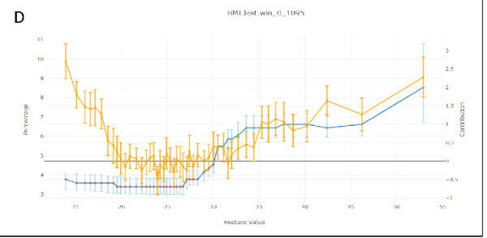

# A Journey into Explainable AI

This is a deeper explaination for my post in Towards Data Science: [When Shapley Values Break: A Guide to Robust Model Explainability](https://towardsdatascience.com/when-shapley-values-break-a-guide-to-robust-model-explainability/)

## Example Result: A Clinical Story

Before diving into the algorithms, let’s look at what we actually achieved. This is what our new engine produces for a colon cancer prediction model.

Consider an 82-year-old patient flagged as High Risk (Score: 0.9). Our system tells the doctor:

  * **MCH_Trends**: Sharply decreasing trend in Mean Corpuscular Hemoglobin.
  * **MCH_Values**: Low absolute values and became anemic recently.
  * **Age**: Advanced age contributes to risk.

This output empowers the doctor to act.
In this case, the phisican will usually tell us: "I don't understand why I need you, this is obvious. The patient is deteriorating and need colonscopy"
I love those responses. It means the model and the explanation is very good. Of course, I took a very clear example of a high score, but anyway, it wasn't working well before doing all our adjustments.

**When we applied "Vanilla" Shapley to real medical data, it was a disaster**

Our models use over 1,000 features, many of which are highly correlated (e.g., "last hemoglobin" vs. "average hemoglobin"). The standard Shapley method tried to be "fair" by splitting credit among all these similar features.
The result? A long, repetitive list of weak signals that diluted the true clinical story. It was like trying to explain a picture of a cat by listing the color of every individual pixel.

**The "Eosinophil#" Disaster**

It got worse. In one test, standard Shapley told us that "eosinophils#" (a white blood cell) was a top risk factor for a patient, even though that value was **missing**! Because our imputation method used age and sex to fill gaps, the algorithm got confused. It attributed the risk to the missing blood cell count rather than the patient's age.
We knew we had to do better.

## Our Secret Sauce

We realized that off-the-shelf solutions were insufficient for the complexities of clinical data. Consequently, we engineered our own implementation, introducing four key innovations now available in our [MedPython](https://pypi.org/project/medpython) library:

1.  **Native Variable Grouping**:
    Instead of analyzing individual features, we aggregate them into clinical concepts (e.g., grouping all hemoglobin timestamps into a single "Hemoglobin" entity). This is analogous to moving from pixel-level analysis to object recognition in computer vision. It is far more intuitive. Crucially, we didn't just sum the Shapley values of individual features post-hoc. We modified the underlying C++ implementation to calculate Shapley values **directly on the groups**. This allows us to measure the marginal effect of knowing an entire clinical concept versus not knowing it.
2.  **First-Order Adjustment for Correlated Variables**:
    To solve the credit-splitting problem, we built a "correlation-aware" system. We calculate the covariance matrix(and have experimented with mutual information) between all our feature groups and use it to adjust the contributions. This way, the contribution of a concept isn't diluted across many similar features.
3.  **Iterative Diversity Selection**:
    Even with grouping, standard ranking can yield a list of redundant concepts. To solve this, we implemented an iterative selection process within the C++ algorithm. We identify the most important group, "lock" its value (treat it as known), and then ask the model: "Given this information, what is the **next** most important factor?" This conditional approach produces a minimal, diverse set of features that tells a distinct clinical story.
4.  **Domain-Specific Heuristics**:
    Finally, we integrated a layer of practical control. We allow for the filtering of contributions based on magnitude, direction (e.g., showing only factors that increase risk), and specific "blacklists" We also implemented strict handling for missing values. While our grouping and correlation methods solved most artifacts, this layer acts as a final safety net to ensure no "noise" from missing data affects the explanation.

## Beyond Explanation: Debugging & Validation

Beyond providing individual patient insights, these tools proved invaluable for **model debugging and bias detection**. In several cases, they helped us uncover hidden biases that required retraining or fixing our models.

To do this, we developed a specific validation plot for our top features. We binned the data by feature value and, for each bin, overlaid three metrics:

1.  **Average Shapley Value** (The explanation)
2.  **True Outcome Probability** (The reality)
3.  **Mean Model Score** (The prediction)

It was particularly fascinating to analyze divergences. Specifically, instances where the Model Score and Outcome Probability rose, but the Shapley value for that specific feature remained flat. This gap allowed us to distinguish between features the model was actually **using** versus features that were merely **correlated** with the outcome.

**A Real-World Example: The "BMI Paradox"**
We saw a striking example of this in our **Flu Complications** model. In medical data, **Low BMI** is strongly correlated with children, and children are naturally at higher risk for complications like pneumonia.

A naive analysis (or a standard correlation study) might suggest that Low BMI is a risk factor. However, our Shapley analysis confirmed that the model had successfully disentangled this relationship. The plots showed that while risk scores were high for these patients, the attribution went solely to **Young Age**. The model correctly identified Age as the driver and did not treat Low BMI as a risk factor, proving it wasn't relying on spurious correlations.

As can be seen from [FluComplication Paper](https://pubmed.ncbi.nlm.nih.gov/35893436/)

We can see the U shape of the risk score as a function of BMI in orange, but the Shapley Values in blue, remains low in lower values of BMI.

## Can we Use This?

We've integrated this powerful explainability engine directly into our platform. If you're using our MedModel JSON format, you can add a `tree_shap` post-processor to your model pipeline definition at the end and use our [Tutorial](../Tutorials/04.Train%20Model) to train your model:

```json
{
    "action_type": "post_processor",
    "pp_type": "tree_shap",
    "attr_name": "name_of_attribute_to_store_output",
    "filters": "{max_count=10;sort_mode=0}",
    "processing": "{grouping=BY_SIGNAL_CATEG_TREND;iterative=1;learn_cov_matrix=1;zero_missing=1}"
}
```

This will give you the same rich, diverse, and intuitive explanations that our doctors and data scientists found much more valuable.
This Exactly same method was used in the [CMS AI Health Outcomes Challenge](https://www.cms.gov/priorities/innovation/innovation-models/artificial-intelligence-health-outcomes-challenge) for all caused mortality and COPD hospital readmission within 30 days. Our platform was resulted as award-winner in this competition.

This method is only applicable for tree based model in our platform - xgboost, lightgbm, QRF(Quantized Random Forest - our implementation for random forest), BART(Baysian Additive Regression Trees).
The other predictor will need to use our other shapley methods that are model agnostic and unrelated to trees. They are slower, but also performs quite well.

## Deeper Dive Into Mathematics, Methodology and Algorithm Explored 

### The Explainability Competition

To find the best explainer we held a competition. We benchmarked several explainability methods against each other, testing them on three of our real-world medical models for robustness:

*   ColonFlag: A model that predicts the risk of colon cancer.
*   [Pre2D](../Models/Pred2D.md): A model that assesses the risk of diabetes from pre-diabetic.
*   [FluComplications](../Models/FluComplications.md): A model that predicts complications from the flu.

Our judges were a panel of data scientists and our Chief Medical Officer. They reviewed the explanations from each method in a "blind testing" and ranked each with a score 1(bad)-5(good). they didn't know which method produced which explanation. This helped us avoid bias and focus on what really mattered: which method gave the most intuitive and medically relevant explanations. Each reviewer was reviewing a specific prediction across all the different methods together to have also a relative sense of how good the presented explanation. 

The process was iterative and in each step we explored more varaiation of the winning methods to improve our results that were promising, but weren't satisfiying in the previous step. Each evaluation included 3-7 different methods to review and rank.

### Common Explainability Methods

We started with the most popular methods out there, which generally fall into three categories:

1.  **Shapley Values-based methods**: These are the state of the art for the data science world, based on a concept from game theory.
2.  **LIME and Noising methods**: These methods work by "noising" the model - changing the input data slightly to see how the prediction changes.
3.  **The Naive Approach**: The simplest method of all - just removing a feature (setting it to 0 or missing value) to see what happens.

**Spoiler alert**: The naive approach and simple noising methods were a disaster. Our medical data is a very complex, with variables on wildly different scales and distributions. These simple methods just couldn't handle it. Even the "vanilla" Shapley values, the supposed gold standard, fell too short.

### Why the "Gold Standard" didn't worked

So what are Shapley values, and why didn't they work for us?

Imagine a team of players in a game, and you want to figure out how much each player contributed to the win. That's the basic idea behind Shapley values. They provide a way to fairly distribute the "payout" (the model's prediction) among the "players" (the input features).

Mathematically, it looks like this:

$$
\phi_i(v) = \sum_{S \subseteq N \setminus \{i\}} \frac{|S|! (n - |S| - 1)!}{n!} (v(S \cup \{i\}) - v(S))
$$

Don't let the equation scare you. The core idea is in the $v(S \cup \{i\}) - v(S)$ part. It measures the added value of feature `i` when it's added to a group of features `S`. The formula then calculates the average of this added value (knowing the parameter value VS not knowing) over all possible groups of features.

This approach offers several valuable theoretical properties. Notably, the Shapley value is the **unique** attribution method that satisfies all the following axioms simultaneously:

* **Linearity**: The sum of all individual feature contributions equals the total model prediction.
* **Null Player**: A feature that has no impact on the prediction is assigned a Shapley value of zero.
* **Symmetry**: Two features that contribute equally to the prediction receive the same Shapley value. This is particularly interesting when dealing with correlated variables.
    - **Example**: Consider two variables, $x_1$ and $x_3$, that are perfectly correlated (i.e., $x_1 = x_3$).
    Now, assume a linear model: $F(X) = 1 \cdot x_1 + 2 \cdot x_2 + 0 \cdot x_3$
    Even though the model mathematically weights $x_3$ at zero, a correlation-aware Shapley calculation recognizes that $x_3$ carries the same information as $x_1$. Consequently, the contribution score is split equally between them. This demonstrates that the contribution score accounts for a variable's relationship with other features, not just its isolated mechanical effect on the output.

#### The Computational Challenges

While the theoretical properties of Shapley values are elegant, calculating them directly presents two significant practical hurdles:

1. **The Combinatorial Explosion** The summation requires iterating over every possible subset of features. For a model with $N$ features, calculating the contribution of just one feature involves summing over $2^{N-1}$ subsets. As $N$ grows, this quickly becomes NP-hard. In high-dimensional datasets, an exact calculation is computationally infeasible.
2. **The "Missing Data" Problem** Let’s look at the core of the equation, setting aside the combinatorial weight term $\frac{|S|! (n - |S| - 1)!}{n!}$. The calculation relies on the marginal contribution: $v(S \cup \{i\}) - v(S)$

Obtaining $v(S)$ - the model's output given only a subset of features $S$ is non-trivial. Most machine learning models require a fixed input vector and cannot naturally handle "missing" variables. To calculate $v(S)$ theoretically, we would need to marginalize out the features not in $S$. This implies integrating over the distribution of the missing features (essentially holding the features in $S$ fixed while averaging the model's output over samples drawn from the distribution of the omitted variables). This integration is computationally expensive and difficult to estimate accurately without a generative model of the data.

#### From Theory to Practice

Due to these complexities, most Shapley value implementations in the wild rely on approximations rather than exact solutions. However, for specific model architectures, efficient algorithms exist.

Notably, for [decision tree ensembles](https://www.nature.com/articles/s42256-019-0138-9), there is a polynomial-time algorithm (TreeSHAP) that estimates these values efficiently. At Medial EarlySign, we have expanded upon these tree-based implementations and explored model-agnostic approaches to extend these capabilities beyond standard decision trees.

#### Results of Vanilla Shapley on Medical Data

Sounds great, right? But here's the catch: in the messy world of real-world medical data, these properties doesn't work well.

The biggest problem? **Correlated features.** Our models use over 1,000 features, and many of them are highly correlated. For example, we might have "last hemoglobin value", "average hemoglobin value", and "hemoglobin trend", different time windows. They're all telling a similar story.

The "fairness" property of Shapley values means that the "credit" for this story gets split between all these similar features. This dilutes the importance of the underlying concept (hemoglobin levels) and gives us a long, repetitive list of slightly important features. It's like trying to explain a cat in an image by listing the color of each individual pixel. It is both inefficient and also doesn't make a lot of sense. 

The results were just awful. In one case, the model told us that "eosinophils#" (a type of white blood cell) was a top contributor for a patient's colon cancer risk, even though the value was missing for 99% of patients! This was because our imputation method used age and sex, and age is a huge factor in colon cancer. The Shapley values got confused and attributed the importance of age to the missing feature. It prefered a combination of age + sex over age alone.

Another issue was that similar variables were appearing next ot each other as top contributors and as reviewers we wanted to see a different and minimal set of varaibels to explain a specific prediction.


### The Final Result

So what does this all look like in practice after applying our methods? Let's take a look at two examples for a colon cancer prediction.

**Case 1: A Low-Risk Patient (Score: 0.002)**

A 40-year-old patient. The top contributors to their **low** risk score are:

```
Tree_iterative_covariance(New equation)
Age(40):=-1.82797(39.23%)
MCH_Values:=-0.3587(7.70%)
MCHC-M_Values:=-0.25868(5.55%)
...
```

The explanation is clear: the patient's young age is the biggest factor driving their low risk. Their normal blood test results (MCH, MCHC) also contribute (You can't see here the MCH, MCHC values, but after inspecting them, they were well in the normal range).

**Case 2: A High-Risk Patient (Score: 0.9)**

An 82-year-old patient. The top contributors to their **high** risk score are:

```
MCH_Trends:=2.16768(18.79%)
MCH_Values:=1.26565(10.97%)
Age(82):=1.25866(10.91%)
...
```

Here, the story is different. The biggest red flag is the trend in their MCH (mean corpuscular hemoglobin) values, which have been decreasing sharply. Their absolute MCH value is also low, and their advanced age is a significant factor.

This is the kind of insight that is not just intellectually satisfying, but clinically actionable.

You can see more results and the raw scores from our final benchmark here (unblinded):

*   [compare_all.reviewer1.xlsx](../attachments/11207625/11207634.xlsx)

### Alternative Approaches Explored

Before finalizing our methodology, we explored several model-agnostic approaches. Our goal was to estimate Shapley values by treating the model as a "black box" and approximating the exponential sum via Monte Carlo sampling.

However, even with sampling, the core challenge remains: accurately estimating $v(S)$. To do this effectively, one must generate synthetic values for the "missing" variables based on the fixed known variables. We investigated two distinct generative strategies for this task:

* **Masked GAN (Generative Adversarial Networks)**:
    We implemented a Deep Learning GAN architecture modified with an input mask ($S$) to designate fixed variables.
    * **The Mechanism**: To ensure consistency, we applied a "hard" constraint before the discriminator stage: the generator's output is multiplied by the inverse mask and added to the original input multiplies by the mask. This forces the generator to "fill in the blanks" while preserving the known values exactly.
    * **The Verdict**: The results were promising and comparable to theoretical expectations. However, inference was significantly slower than optimized tree-based algorithms, making it less practical for real-time production use.

* **Gibbs Sampling (Random Walk)**:
    We also explored statistical methods, specifically Gibbs sampling, to reconstruct the joint distribution of the data.
    * **The Mechanism**: This required training $N$ distinct predictors (one for each variable). To estimate the conditional probability $P(x_i | x_{-i})$, we avoided standard regression (which yields a single value) and instead used **XGBoost for multi-class classification**. We binned continuous variables into discrete categories, allowing us to predict a full probability distribution for every feature. Another option is using quantile regression. 
    * **The Process**: We iterate through the variables not in set $S$, drawing new values from these predicted distributions. By repeating this random walk, the system converges to a high-quality synthetic sample.
    * **The Verdict**: In lower dimensions ($<100$ variables), the quality of synthetic data exceeded that of the GAN. However, the process is computationally expensive and iterative. As dimensionality increases, the method suffers from stability issues and the "curse of dimensionality", where strong inter-variable dependencies make the random walk less efficient. Ultimately, it was too slow for our high-dimensional use cases.

* **LIME (Local Interpretable Model-agnostic Explanations)**:
    We also evaluated LIME, which approximates Shapley values by fitting a local linear model around the prediction. We view this as a more efficient way to sample and estimate contributions. However, LIME still faces the same "missing data" hurdle; to function correctly, it also required the underlying synthetic data generation techniques (Masked GAN or Gibbs) described above.


## Final Notes

We learned that the most popular methods aren't always the best, and that true innovation often requires getting your hands dirty and building something new.
Creating Explainable model helps to build better model, trust and to empower doctors.
That's a future we're excited to be a part of.

If you like this, please don't hesitate to message me on [Linkedin](https://www.linkedin.com/in/lanyado/) and tell me what part you liked the most.