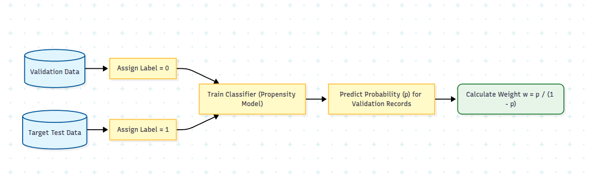
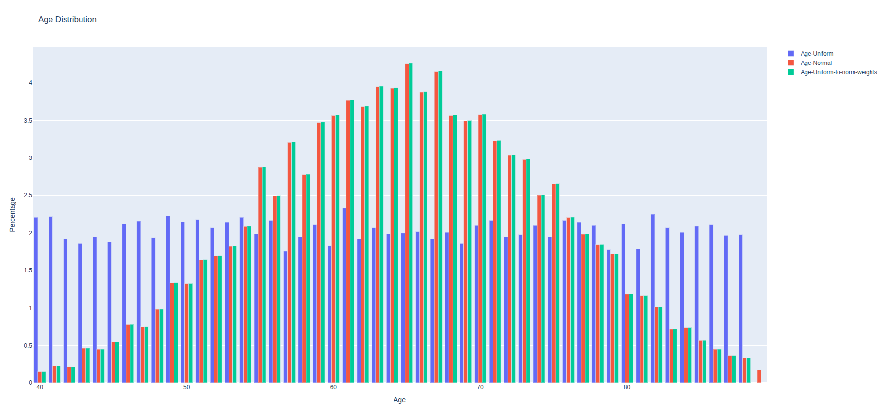

# Stop Blaming the Data: A Better Way to Handle Covariance Shift

Despite tabular data being the bread and butter of industry data science, there is a pervasive oversight when analyzing model performance.

We’ve all been there: You develop a machine learning model, achieve great results on your validation set, and then deploy it (or test it) on a new, real-world dataset. Suddenly, performance drops.

**So, what is the problem?**

Usually, we point the finger at **Covariance Shift**. The distribution of features in the new data is different from the training data. We use this as a "Get Out of Jail Free" card: "The data changed, so naturally, the performance is lower. It's the data's fault, not the model's."

But what if we stopped using covariance shift as an excuse and started using it as a tool? 

I believe there is a more robust way to handle this: a "gold standard" for analyzing tabular data that allows us to estimate performance accurately, even when the ground shifts beneath our feet.

## The Problem: Comparing Apples to Oranges

Let’s look at a simple example from the medical world.

Imagine we trained a model on patients aged **40-89**. However, in our new target test data, the age range is stricter: **50-80**.

If we simply run the model on the test data and compare it to our original validation scores, we are cheating. To compare "apples to apples," a diligent data scientist would go back to the validation set, filter for patients aged 50-80, and recalculate the baseline performance.

**But let's make it harder.**

Suppose our test dataset contains millions of records aged 50–80, and **one single patient** aged 40.

* Do we compare our results to the validation 40-80 range?
* Do we compare to the 50-80 range?

If we ignore the specific age distribution (which most standard analyses do), that single 40-year-old patient theoretically shifts the definition of the cohort. In practice, we might just delete that outlier. But can we generalize this? Can we automate this process to handle differences in **multiple variables** simultaneously without manually filtering data?

## The Solution: Importance Weighting

The solution is to mathematically re-weight our validation data to look like the test data. Instead of binary inclusion/exclusion (keeping or dropping a row), we assign a continuous **weight** to each record in our validation set. It is like an extenstion of the above simple filtering method to match the same age range.

* **Weight = 1:** Standard analysis.
* **Weight = 0:** Exclude the record (filtering).
* **Weight = 0.5 or 2.0:** Down-sample or Up-sample the record's influence.

### The Intuition
In our example (Test: Age 50-80 + one 40yo), the solution is to mimic the test cohort within our validation set. We want our validation set to "pretend" it has the exact same age distribution as the test set.


> [!Note:] While it is possible to transform these weights into binary inclusion/exclusion via random sub-sampling, this generally offers no statistical advantage over using the weights directly. Sub-sampling is primarily useful for intuition or if your specific performance analysis tools cannot handle weighted data.

### The Math
Let's formalize this. We need to define two probabilities:
* $P_t(x)$: The probability of seeing feature $x$ (e.g., Age) in the **Target Test** data.
* $P_v(x)$: The probability of seeing feature $x$ in the **Validation** data.

The weight $w$ for any given record with feature $x$ is the ratio of these probabilities:

$$
w(x) = \frac{P_t(x)}{P_v(x)}
$$

This is intuitive. If 60-year-olds are rare in training ($P_v$ is low) but common in production ($P_t$ is high), the ratio is large. We weight these records **up** in our evaluation to match reality.

This is a statistical technique often called **Importance Sampling** or **Inverse Probability Weighting (IPW)**.

By applying these weights when calculating metrics (like Accuracy, AUC, or RMSE) on your validation set, you create a synthetic cohort that perfectly matches the test domain. You can now compare apples to apples without complaining about the shift.

## The Extension: Handling High-Dimensional Shifts

Doing this for one variable (Age) is easy-you can just use histograms/bins. But what if the data shifts across 50 different variables simultaneously? We cannot build a 50-dimensional histogram.

The solution is a clever trick using a binary classifier.

We train a new model (a "Propensity Model," let's call it $M_p$) to distinguish between the two datasets.

* **Input:** The features of the record (Age, BMI, Blood Pressure, etc.) or our desired variables to control for.
* **Target:** `0` if the record is from Validation, `1` if the record is from the Test set.

If this model can easily tell the data apart (AUC > 0.5), it means there is a covariate shift. Crucially, the probabilistic output of this model gives us exactly what we need to calculate the weights.

Using Bayes' theorem, the weight for a sample $x$ becomes the **odds** that the sample belongs to the test set:

$$
w(x) = \frac{M_p(x)}{1 - M_p(x)}
$$

* If $M_p(x) \approx 0.5$, the data points are indistinguishable, and the weight is 1.
* If $M_p(x) \rightarrow 1$, the model is very sure this looks like Test data, and the weight increases.



### Does it work?
Yes, like magic. If you take your validation set, apply these weights, and then plot the distributions of your variables, they will perfectly overlay the distributions of your target test set.
It is even more **powerful** than that: it aligns the **joint distribution** of all variables, not just their individual marginals. Your weighted validation data becomes practically indistinguishable from the target test data.

You can for example this code snippet for generating 2 age distributions: one uniform, the other random, with the obvious transformation.
It is very simple and still rarely used.


<details>
       <summary>Code snippet</summary>

```python title="Code to generate the simple samples with 1 variable"
import pandas as pd
import numpy as np
import plotly.graph_objects as go

df = pd.DataFrame({"Age": np.random.randint(40,89, 10000) })
df2 = pd.DataFrame({"Age": np.random.normal(65, 10, 10000) })
df2["Age"] = df2["Age"].round().astype(int)
df2 = df2[df2["Age"].between(40,89)].reset_index(drop=True)

df["count"]=1
df2["count"]=1

age_count1 = df.groupby("Age").count().reset_index().sort_values("Age")
age_count1["Percentage"] = 100 * age_count1["count"] / len(df)

age_count2 = df2.groupby("Age").count().reset_index().sort_values("Age")
age_count2["Percentage"] = 100 * age_count2["count"] / len(df2)

age_stats = age_count1[["Age", "Percentage"]].merge(age_count2[["Age", "Percentage"]].rename(columns={"Percentage": "Percentage2"}), on=["Age"])
age_stats["weight"] = age_stats["Percentage2"] / age_stats["Percentage"]

df3 = df.copy()
df3 = df3.merge(age_stats[["Age", "weight"]], on=["Age"])
tot = df3["weight"].sum()

age_count3 = df3.groupby("Age")["weight"].sum().reset_index().sort_values("Age")
age_count3["Percentage"] = 100 * age_count3["weight"] / tot

fig = go.Figure()
f1 = go.Bar(x=age_count1["Age"], y=age_count1["Percentage"], name="Age-Uniform")
f2 = go.Bar(x=age_count2["Age"], y=age_count2["Percentage"], name="Age-Normal")
f3 = go.Bar(x=age_count3["Age"], y=age_count3["Percentage"], name="Age-Uniform-to-norm-weights")

fig.add_trace(f1)
fig.add_trace(f2)
fig.add_trace(f3)

fig.update_xaxes(title_text='Age') # Set the x-axis title
fig.update_yaxes(title_text='Percentage') # Set the y-axis title
fig.update_layout(title="Age Distribution")

fig.show()
```

</details>

## Limitations

While this is a powerful technique, it is not a silver bullet. There are thress main statistical limitations:

1.  **Hidden Confounders:** If the shift is caused by a variable you didn't measure (e.g., a genetic marker you don't have in your tabular data), you cannot weigh for it. However, as model developers, we usually assume the most predictive features are already in our dataset.
2.  **Ignorability (Lack of Overlap):** You cannot divide by zero. If $P_v(x)$ is zero (e.g., your training data has *no* patients over 90, but the test set does), the weight explodes to infinity.
    * *The Fix:* Identify these non-overlapping groups. If your validation set literally contains zero information about a specific sub-population, you must explicitly exclude that sub-population from the comparison and flag it as "unknown territory."
3. **Propensity Model Quality**: Since we rely on a model ($M_p$) to estimate weights, any inaccuracies or poor calibration in this model will introduce noise. For low-dimensional shifts (like a single 'Age' variable), this is negligible, but for high-dimensional complex shifts, ensuring $M_p$ is well-calibrated is critical.

> **⚠️ A Note on Statistical Power**
> Be aware that using weights changes your **Effective Sample Size**. High-variance weights reduce the stability of your estimates. 
> * **Bootstrapping:** If you use bootstrapping, you are safe as long as you incorporate the weights into the resampling process itself.
> * **Power Calculations:** Do not use the raw number of rows ($N$). Please refer to the **Effective Sample Size** formula (Kish's ESS) to understand the true power of your weighted analysis.

## Summary

The best practice for evaluating model performance on tabular data is to strictly account for covariance shift. Instead of using shift as an excuse for poor performance, use **Importance Weighting** to estimate how your model should perform in the new environment.

This allows you to answer the hardest question in deployment: "Is the performance drop due to the data changing, or is the model actually broken?"

If you utilize this method, you can explain the gap between training and production metrics with mathematical precision.

---
If you found this useful, let's connect on [LinkedIn](https://www.linkedin.com/in/lanyado/)