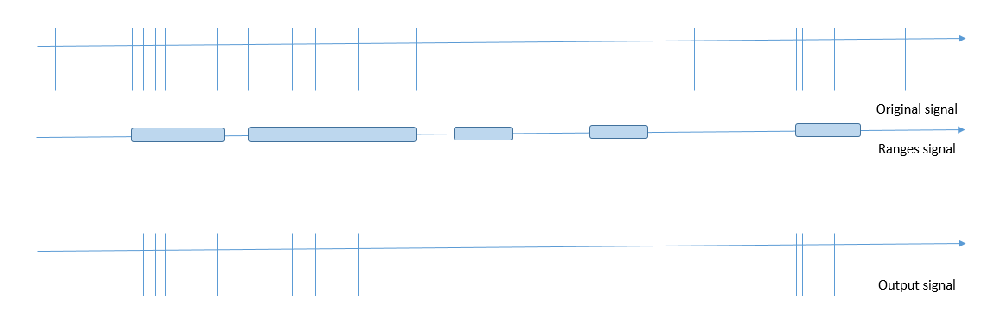

# RepBasicRangeCleaner
Does not support range input signals, if a signal has more than one time channel, choose the relevent one.
Should be run after RepAggregationPeriod
 
rp_type - "range_cln". (required)
signal_name - the name of the signal to process. (required) ie "Albumin". 
ranges_sig_name - the name of the ranges signal to use. (can be the output signal of the RepAggregationPeriod processor)
output_name - the name of the resulting virtual signal. defaults to a combination of the input and ranges signal.
time_channel - the time channel of the signal that will be used to decide if to keep or discard the signal instance. defaults to 0.
output_type - the signal type of the output signal, should be the same as the input signal, defaults to 3 (2 time + value channels).
 
```json
{
      "action_type": "rep_processor",
	  "rp_type":"range_cln",
	  "signal_name":"Albumin",
	  "ranges_sig_name":"drugs_sets_period",
      "time_channel":"0"
},
```
 

(Code that tests this rep processor: U:\ReutF\MR\Projects\Shared\check_medication_period_rep_processor)
