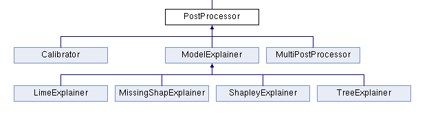
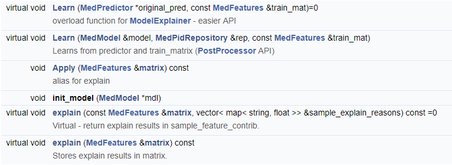

# PostProcessors Practical Guide
PostProcessors are processors which occours after predicitons.
Full PostProcessor code doc: [https://Medial-EarlySign.github.io/MR_LIBS/classPostProcessor.html](https://Medial-EarlySign.github.io/MR_LIBS/classPostProcessor)
Some PostProcessor, for full list of types and json values to put in names please reffer to [PostProcessor_Types](https://Medial-EarlySign.github.io/MR_LIBS/PostProcessor_8h.html#a1dab070b8206be89206ff19f321a1cfc).

* We have now MultiPostProcessor (for parallelism)
* `Calibrator` - to calibrate scores to probabilities for example
* ModelExplainer - Several options for ButWhy:
	- `tree_shap` - The common and our method for explainability based on shapley values. There other "explainability" methods, some of them are model agnostic and not only for tree base (but they are more computational expensive)
* `fairness_adjust` - Post processings of scores to adjust for fairness between groups. Was deployed in [AAA model](../../Models/AAA.md)


 
PostProcessor API:

 
ModelExplainer API:

 
Examples:

- Calibration
- Explainer of prediction "But Why"
 
Example for calibration:
```json
{
	  "action_type":"post_processor",
	  "pp_type":"calibrator",
	  "calibration_type":"binning",
	  "min_preds_in_bin":"200",
	  "min_prob_res":"0.005",
	  //"calibration_samples":"", //on train or give your samples to calibrate on
	  "verbose":"1"
}
```
Example for explainer:
 
Tree Shapley:
```json
{
	  "action_type":"post_processor",
	  "pp_type":"tree_shap",
	  "approximate":"0",
	  "interaction_shap":"0"
}
```
LIME:
```json
{
	  "action_type":"post_processor",
	  "pp_type":"lime_shap",
	  //"pp_type":"shapley",
	  "gen_type":"GIBBS",
	  "n_masks":"500", //how many masks to sample for learn
	  "generator_args":"{kmeans=0;select_with_repeats=0;max_iters=0;predictor_type=qrf;predictor_args={spread=0;type=categorial_entropy;learn_nthreads=40;predict_nthreads=40;ntrees=50;maxq=500;min_node=300;get_only_this_categ=-1};num_class_setup=n_categ;bin_settings={split_method=iterative_merge;min_bin_count=500;binCnt=150};selection_ratio=1.0}", //when using Gibbs, otherwise give GAN path here
	  "sampling_args":"{burn_in_count=50;jump_between_samples=10;samples_count=1;find_real_value_bin=1;use_cache=0}" //in GAN not needed
}
```
