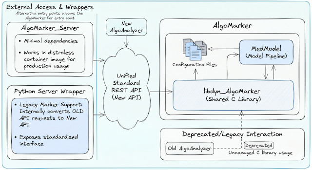

# AlgoMarkers

AlgoMarkers are wrappers for models or calculators that "talk" to other services via the API defined in `AlgoMarker.h` (API functions start with `AM_API_...`). The AlgoMarker is a C library, and we provide an `AlgoMarker_Server` that exposes the library and model as a REST API. While this can also be easily done with Python FastAPI, using the `AlgoMarker_Server` might be better for minimal deployments.

This section has been reorganized to make finding information easier. Please select a topic from the directory below:

## Documentation Directory

- [Setup & Packaging](Setup%20a%20new%20AlgoMarker.md): A step-by-step guide to packaging, configuring, and freezing a new AlgoMarker for production.
    * [Configuration & Eligibility Rules](Configuration.md): Learn how to configure a standard MedialInfra AlgoMarker and define eligibility filters (`.amconfig`).
- [Testing with DllAPITester](Testing-with-DllAPITester.md): How to use the `DllAPITester` tool to validate your compiled AlgoMarker.
- [Request JSON Format](Request%20Json%20Format.md): Details on the expected JSON request and response formats.
- [Custom AlgoMarker Development](Custom%20Development.md): Advanced guide on writing and compiling a custom C++ AlgoMarker class.
- [AlgoMarker Inspection](AlgoMarker%20inspection.md): Cheatsheet for listing rules, outliers, and model info.

## AlgoMarker Architecture

The usage is very simple, there are 2 main API endpoints:

* discovery: no inputs, just returns information about the AlgoMarker name, inputs, and outputs
* calcualte: the request with the data for processing

