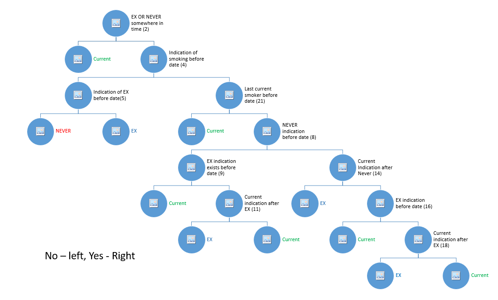

# Code Documnetation

## Learn flow
 
General comment: Passive smoker is treated as Never smoker status.
NEVER_OR_EX_SMOKER => it is being resolved by all the smoking information if the patient has no indication of smoking, ex smoking or quit date, it is being used as never, otherwise EX.

1. After reading signals it calls getQuitAge to store ageAtEx,deltaTime vectors for each patient. It ignores samples and being calculated per patient (uses last sample to ensure we are not using information after last time that will be later filtered to speedup. It has dates for each "change" so we can later filter it and use the information that is only available at prediction time).
2. getQuitAge
3. Calls genFirstLastSmokingDates => vector<int> dates: vector whenever something changes in the smoking info (either new smoking status information date or quit smoking date value, that refers the past). and map<> smokingStatusDates - for each smoking status first and last date of this indication. IT is being calculated by iterating over smoking_status signal + using smoking_quit date signal. When there is quit_date, it results in "current_smoker" status in the day before and "ex_smoker" status in quit date and it process this information to update smokingStatusDates. Also handles Never_or_Ex smoking status. If no indication of current smoking or ex smoking in smokingStatusDates after all this logic (means, even no quit date) it will use this information to update never_smoker status, otherwise it will use to update ex smoker.
4. Calls genSmokingStatus => vector smokingStatusVec: iterate "dates" vector that indicates any change in smoking info and in each date updates the current status by decision tree. return if stopped smoking the stopped age and delta time between last current indication and stopped smoking date. If didn't stop - missing values. It's in order to learn relation between age that stopped smoking and delta time from quit date to last current
5. Learns a linear model from age at stopped smoking to time delta from quit date to last current status => slope + bias parameter

## Generate flow

1. calls genFirstLastSmokingDates as in _learn, but for each sample, limited till prediction date
2. Calls genSmokingStatus as in _learn, but for each sample, limited till prediction date
3. Calls genSmokingRanges. generates time ranges for smoking status and returns it in sorted vector by date of smokeRanges. Iterates through status and update in each smoking status change:
4. If past state was never/unkown =>and changed to current smoking. set the start smoking time to current date status or to Age of 20 if no previous smoking status (was unknown and no indication of never after age 20). If there is indication of never smoker after age 20, this is the minimal start point for being never smoker till the smoking indication.
5. If status is changed between  current_smoker and EX_Smoker - switch the time range in the middle 
6. If past state was never/unkown =>and changed to EX smoking. calculates age that stopped smoknig indication
7. if past was unknown and current indication is never. end unknown time range and start new time period for never smoker from this indication date. If had Quit_Smoking date, the difference in time between current and EX will be 1 day - no problem and no holes. If the change is due to smoking status - there is a hole in time between the statuses and it will use the linear slope from the age to determine the age the patient really stopped smoking. 
8. Calls genLastStatus - fetches last smoking status from smokeRanges for smoking_statuts features
9. Calls calcQuitTime - Measure the number of days/years that stopped smoking. If current it's 0, if Never - it's like quit on his birth date, if ex smoker - using the ex date
10. Calls calcSmokingIntensity - Smoking intensity valid values are 0-200 otherwise ignored. above 140 value is trimmed to 140 cigars/day.  calculates average number in all time window, 0 value for never smoker
11. Calls calcPackYears - takes values > 0. calculates max and last pack years in the time till the sample. If never smokers - it's 0. If has pack_years >0, changes never_smoker status to 0. if not current_smoker, turns on the ex_smoker (**MEANS you need to load PACK_YEARS only for smokers and non zero values**)
12. Calls calcSmokingDuration - 0 for never smoker. if not unknown smoker. Calculate smoking_duration and smokingDurationBeforeLastPackYears. 
18. Calls getLastSmokingDuration -that return the last time and value of intensity before sample time. Calculates this again for last time before last pack_years date indication. 
13. Sums the current_smoker statuts time ranges - instead of using full time period, uses the lastDurationDateBeforTestDate as starting time point for calculation, since till this time you have the smoking intensity provided by the user. It does this also for last_pack_years - till the last pack years information
14. Calls fixPackYearsSmokingIntensity: if no last pack years and has smoking duration + intensity => calculate pack years. If last pack years exists, validate it when smoking duration exists and not zero. When smoking intensity exists - add the delta from last, max pack years date multiply by smoking intensity(average). If smoking intensity is missing => complete the intensity from pack years + duration
You can set "debug_file" argument to debug smoking generation
