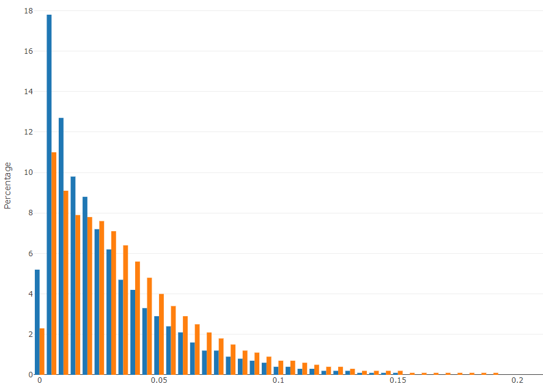
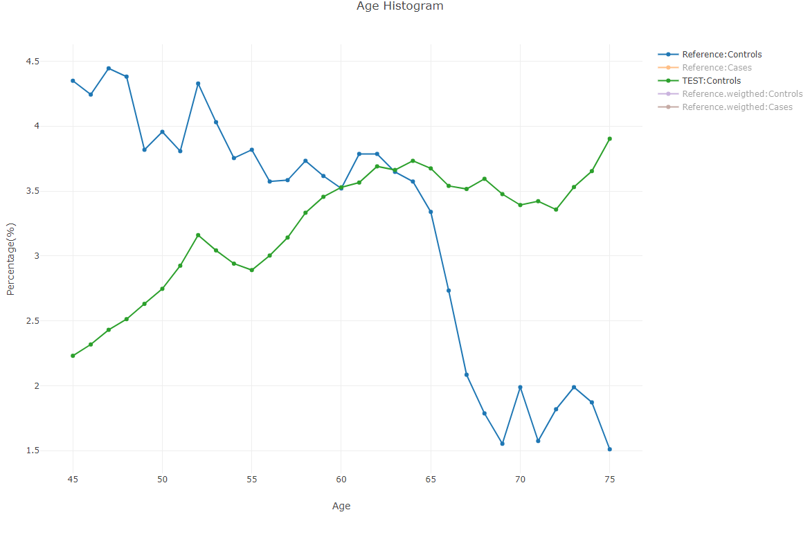

# Test 06 - Compare Score Distribution

## Purpose

Compare model score distributions between the reference dataset (training matrix) and the new test repository. This validates that score moments, cutoffs, and distributional shape are consistent and helps detect shifts that could affect model performance.

## Required Inputs
From `configs/env.sh`:

- `WORK_DIR`: Working directory where repository, samples, predictions, and compare artifacts are stored
- `REFERENCE_MATRIX`: Full path to the reference feature matrix (used to recreate reference predictions)
- `MODEL_PATH`: Path to the fitted Medial model (the test will default to `${WORK_DIR}/model/model.medmdl`) and depends on [Test 02](Test%2002%20-%20Fit%20Model%20to%20Repository.md)
- Optional environment controls used by the TestKit: `MEMORY_LIMIT` (limits model memory usage), and the samples created by Test 03 under `${WORK_DIR}/Samples` (especially `3.test_cohort.samples` and `1.all_potential.samples`)

## How to Run
From your TestKit folder, execute:
```bash
./run.specific.sh 6
```
Or include as part of the full suite:
```bash
./run.sh
```

Check `${WORK_DIR}/compare` for produced score reports and HTML visualizations.

## What This Test Does

High-level flow:

- Ensures `MODEL_PATH` is set (uses `${WORK_DIR}/model/model.medmdl` by default)
- Generates model predictions for the full potential sample set (`${WORK_DIR}/predictions/all.preds`) and for the test cohort (`${WORK_DIR}/compare/3.test_cohort.preds`) using [Flow get_model_preds](../../../Using%20the%20Flow%20App/index.md#predictingapplying-a-model)
- Converts `REFERENCE_MATRIX` rows into a predictions-like TSV (`${WORK_DIR}/compare/reference.preds`) when needed
- Computes basic score moments (mean, STD) for Reference, Test_Run, and Test_Run.Original (if available) and writes them to `${WORK_DIR}/compare/compare_score.txt`
- Produces a binned score distribution TSV `${WORK_DIR}/compare/score_dist.tsv` and an HTML histogram `${WORK_DIR}/compare/score_dist.html`
- Runs `compare_scores.py` (helper script) to compute additional statistics and saves its outputs under `${WORK_DIR}/compare`
- Runs bootstrap analyses ([bootstrap_app](../../../bootstrap_app)) to compute score-related performance measures and formats them with `bootstrap_format.py` into `compare_score.txt`

The script includes timestamp checks and will avoid re-running expensive prediction steps when outputs are up to date.

## Output Location

- `${WORK_DIR}/compare/compare_score.txt` - textual summary with means, stds and formatted bootstrap measures
- `${WORK_DIR}/compare/score_dist.tsv` - binned score distribution (Reference vs Test_Run)
- `${WORK_DIR}/compare/score_dist.html` - histogram visualization (Plotly)
- `${WORK_DIR}/compare/3.test_cohort.preds` and `${WORK_DIR}/predictions/all.preds` - prediction files used for analysis
- Bootstrap reports: `${WORK_DIR}/compare/bt.*.pivot_txt` and related formatted outputs

## How to Interpret Results

- Compare the mean and STD lines in `${WORK_DIR}/compare/compare_score.txt` for `Reference`, `Test_Run`, and `Test_Run.Original`. `Test_Run` and `Test_Run.Original` should be nearly identical (exactly identical is expected in most cases). This compares AlgoAnalyzer scores and our execution of scores. Minor difference might exists due to floating point percision implemnetation of AlgoAnalyzer. There might be difference from `Reference`.
- If `Test_Run` and `Test_Run.Original` differ, the test prints Pearson and Spearman correlations and RMSE (helpful to detect computation mismatches). Small numeric differences may occur in some historical configurations (e.g., LGI).
- Inspect `score_dist.html` to visually compare the two score histograms `Reference` and `Test_Run`. Large shifts or multimodal changes may indicate distributional drift or population differences.
- Review bootstrap measures (`SCORE@PR`) to see changes in relevant score cutoffs (for example, top-percentile performance).

### Common failure modes and suggestions

- Missing samples/predictions: Ensure Test 03 ran successfully and `${WORK_DIR}/Samples/3.test_cohort.samples` exists. If not, re-run sample generation.
- `Flow` not found or model load issues: Verify the Medial runtime and `Flow` binary are available in PATH and that `MODEL_PATH` points to a valid model file.
- Memory errors during prediction: Set `MEMORY_LIMIT` in `configs/env.sh` or increase available memory on the host. The script will inject a model-change flag to limit in-memory data if `MEMORY_LIMIT` is set.

## Example output snippets

Contents of `${WORK_DIR}/compare/compare_score.txt` (example):

```text
Test	Mean	STD
Reference	0.1234	0.0456
Test_Run	0.1240	0.0460
Test_Run.Original	0.1240	0.0460
...
```

* Score distribution compare: 
* Age distribution compare: 

## Notes and Implementation Details

- The script patches a Plotly HTML template so the generated `score_dist.html` references `js/plotly.js` relative to the docs/site structure.
- Reference predictions are synthesized from `REFERENCE_MATRIX` by extracting columns assumed to contain the predicted score (awk transformation used in script).
- `compare_scores.py` (in `resources/lib`) performs more detailed numeric comparisons and writes additional logs under `${WORK_DIR}/compare`.

## Troubleshooting

- If HTML plot is blank or doesn't render, confirm `${WORK_DIR}/tmp/plotly_graph.html` exists and that `js/plotly.js` is available at the path expected by the patched HTML template.

## Test Results Review

Primary files to inspect after running this test:

- `${WORK_DIR}/compare/compare_score.txt`
- `${WORK_DIR}/compare/score_dist.html` and `${WORK_DIR}/compare/score_dist.tsv`
- `${WORK_DIR}/predictions/all.preds` and `${WORK_DIR}/compare/3.test_cohort.preds`
- Bootstrap reports: `${WORK_DIR}/compare/bt.*.pivot_txt`
