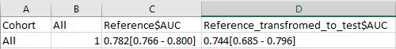

# Test 11 - Estimate Performances

## Purpose

Estimate expected model performance on the tested dataset by re-weighting or sampling the reference cohort to match the distribution of important features in the tested dataset and then measuring AUC with bootstrap confidence intervals.

## Required Inputs
From `configs/env.sh` and the test environment:

- `WORK_DIR`: working directory where compare artifacts are stored
- `REFERENCE_MATRIX`: path to the reference matrix used for matching/sample generation
- `CMP_FEATURE_RES`: list of important features used elsewhere in the kit (used indirectly by weighting steps)
- The script depends on output from earlier tests (notably Test 05) and expects:
	- `${WORK_DIR}/compare/reference.preds`
	- `${WORK_DIR}/compare/rep_propensity.calibrated.model` (or produced model at `${WORK_DIR}/compare.no_overfitting/rep_propensity.calibrated.model`)

## How to Run
From your TestKit folder, execute:
```bash
./run.specific.sh 11
```
Or include as part of the full suite:
```bash
./run.sh
```

Check `${WORK_DIR}/compare.no_overfitting` for outputs and logs.

## What This Test Does

- Computes propensity/importance weights on the reference matrix with:
	- `Flow --get_propensity_weights --f_matrix <REFERENCE_MATRIX> --f_preds <WORK_PATH>/labeled_weights.preds --f_model <PROP_MODEL> ...`
	- These weights are used to reweight the labeled reference examples to emulate the test distribution.
- Runs bootstrap analyses on the original reference (`bootstrap_app --input ${WORK_DIR}/compare/reference.preds`) producing `${WORK_PATH}/bt_reference*` outputs.
- Runs a weighted bootstrap using the labeled weights file (`bootstrap_app --input ${WORK_PATH}/labeled_weights.preds --weights_file "attr:weight"`) to estimate expected performance when reference is transformed to the test distribution. Results are in `${WORK_PATH}/bt_reference.estimated*`.
- Calls `bootstrap_format.py` to produce a human-readable summary table and writes `${WORK_PATH}/summary_table.estimated_performance.tsv`.

## Output Location

- `${WORK_DIR}/compare.no_overfitting/summary_table.estimated_performance.tsv` - main summary table comparing original and estimated performance
- `${WORK_DIR}/compare.no_overfitting/bt_reference.estimated.pivot_txt` and related `bt_reference*` bootstrap output files - raw bootstrap results

## How to Interpret Results

- The primary output is a table showing AUC (and other measures, when enabled) for:
	- The original reference dataset (baseline)
	- The estimated reference transformed to the test distribution (expected performance)
- The table includes point estimates and bootstrap-derived confidence intervals. A drop in AUC from reference to estimated indicates expected degradation due to distributional differences.

Interpretation advice:

- Large increases in the confidence interval or substantial drops in AUC suggest that the test dataset is different from the reference in ways that affect model performance.
- You can reduce variance of the estimate by decreasing the number of important features used for matching (trades off bias vs variance).

## Troubleshooting

- Missing `REFERENCE_MATRIX` or `rep_propensity` model: ensure previous tests completed and `REFERENCE_MATRIX` is available; `rep_propensity.calibrated.model` must be present under `${WORK_DIR}/compare.no_overfitting` or `${WORK_DIR}/compare`.
- `Flow` not found or failing: verify `Flow` is on PATH 
- Bootstrap outputs missing or stale: the script re-runs expensive steps only if input files are newer or `OVERRIDE` is set. if results are stale remove the relevant `bt_reference*` files and re-run.

## Example output files

- `${WORK_DIR}/compare.no_overfitting/summary_table.estimated_performance.tsv` (example values rendered by the test runner)


- Detailed bootstrap analysis can be found in `${WORK_DIR}/compare.no_overfitting/bt_reference.estimated.pivot_txt`


## Notes and Implementation Details

- The script limits extreme weights by `--trim_propensity_weight 0 --max_propensity_weight ${MAX_WEIGHT}` where `MAX_WEIGHT` defaults to 100000 in the script.
- Bootstrap is run with `--sample_per_pid 0` in this script; if your analysis requires different bootstrap parameters, please edit the script or create environment variable for this.
