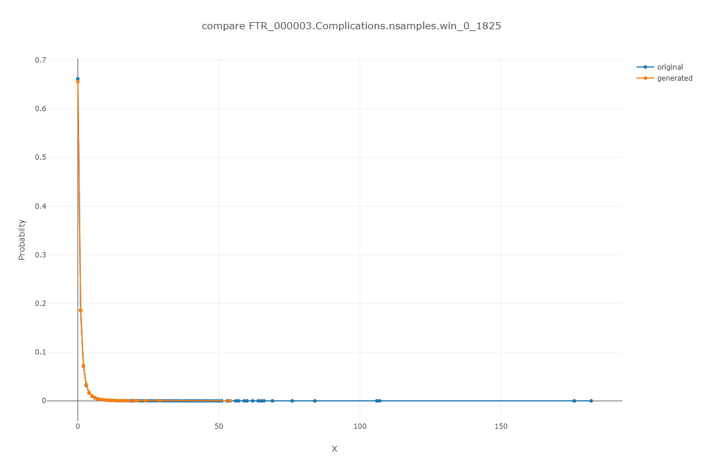
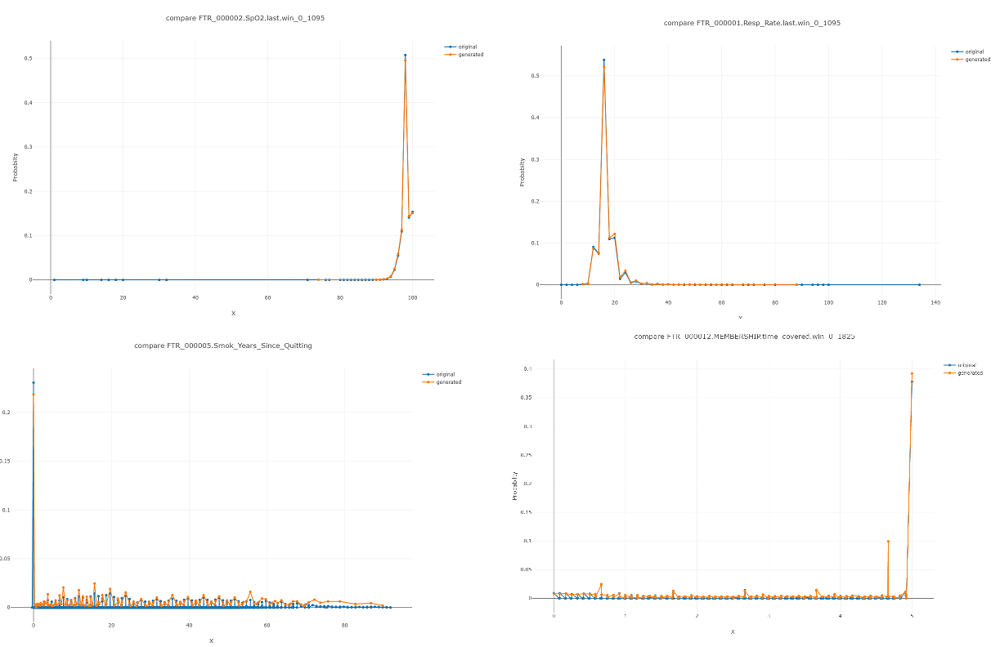
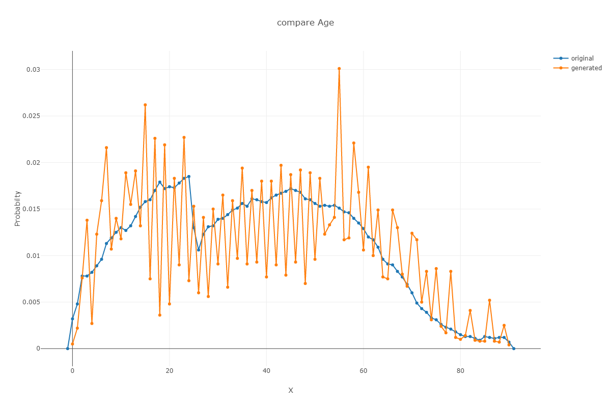

# ButWhy experiments results
- [Expirement models](#ButWhyexperimentsresults-Expirementmodels)
    - [NWP_Flu ](#ButWhyexperimentsresults-NWP_Flu)
    - [CRC](#ButWhyexperimentsresults-CRC)
    - [Pre2D](#ButWhyexperimentsresults-Pre2D)
- [Conclusions](#ButWhyexperimentsresults-Conclusions)
- [Appendix - Gibbs in Flu NWP ](#ButWhyexperimentsresults-Appendix-GibbsinFluNWP)
## **Expirement models**
### NWP_Flu 
The model has 22 features, most of them are binary (Drugs, Diagnosis category_set). The non categorical are: Age, Smoking, SpO2, Resp_Rate, Flu.nsamples, Complications.nsamples, Memebership.
In this run, Added Shapley gibbs explainer (22 features is OK for shapley gibbs -see apendix for more details). 
scores are the higher the better from 1-5. this is the histogram of 18 examples of flu.
Also added average on sqrt of the 1-5 scores to increase the importance for improving on low scores compare to higher scores - no big change here.
<table><tbody>
<tr>
<th>Explainer_name</th>
<th>1</th>
<th>2</th>
<th>3</th>
<th>4</th>
<th>5</th>
<th>Mean_Score</th>
<th>Mean_of_Sqrt_Score</th>
</tr>
<tr>
<th>Tree_with_cov</th>
<td>0</td>
<td>2</td>
<td>3</td>
<td>8</td>
<td>5</td>
<td>3.888889</td>
<td>1.955828857</td>
</tr>
<tr>
<th>Tree</th>
<td>0</td>
<td>2</td>
<td>3</td>
<td>10</td>
<td>3</td>
<td>3.777778</td>
<td>1.929599082</td>
</tr>
<tr>
<th>SHAP_Gibbs_LightGBM</th>
<td>0</td>
<td>1</td>
<td>7</td>
<td>8</td>
<td>2</td>
<td>3.611111</td>
<td>1.889483621</td>
</tr>
<tr>
<th>missing_shap</th>
<td>0</td>
<td>1</td>
<td>9</td>
<td>4</td>
<td>4</td>
<td>3.611111</td>
<td>1.885941263</td>
</tr>
<tr>
<th>LIME_GAN</th>
<td>1</td>
<td>4</td>
<td>7</td>
<td>4</td>
<td>2</td>
<td>3.111111</td>
<td>1.736296992</td>
</tr>
<tr>
<th>SHAP_GAN</th>
<td>2</td>
<td>4</td>
<td>6</td>
<td>6</td>
<td>0</td>
<td>2.888889</td>
<td>1.669397727</td>
</tr>
<tr>
<th>knn</th>
<td>0</td>
<td>7</td>
<td>6</td>
<td>5</td>
<td>0</td>
<td>2.888889</td>
<td>1.682877766</td>
</tr>
<tr>
<th>knn_with_th</th>
<td>8</td>
<td>2</td>
<td>5</td>
<td>2</td>
<td>1</td>
<td>2.222222</td>
<td>1.42915273</td>
</tr>
</tbody></table>
 
Summary - in the simple case of 22 features Tree_with_Covariance preforms the best and than the regular tree.
Not far behind SHAP_Gibbs_LightGBM and missing_shap which preforms similarly.
 
Reference to expirement results:

- [compare_blinded.tsv](../../../../attachments/11207363/11207379.tsv) - the blinded experiment - for each sample random shuffle of explainers outputs. and in xlsx format: [compare_blinded.xlsx](../../../../attachments/11207363/11207385.xlsx)
- [map.ids.tsv](../../../../attachments/11207363/11207380.tsv) - the order of each explainer
- [summary.tsv](../../../../attachments/11207363/11207381.tsv) - results for each sample - with explainers aligned (not blinded) - after joining map.ids.tsv with compare_blinded.tvs
### CRC
<table><tbody>
<tr>
<th>Explainer_name</th>
<th>1</th>
<th>2</th>
<th>3</th>
<th>4</th>
<th>5</th>
<th>&lt;EMPTY&gt;</th>
<th>Score</th>
<th>Score_Sqrt</th>
</tr>
<tr>
<td>Tree_with_cov</td>
<td>0</td>
<td>1</td>
<td>13</td>
<td>21</td>
<td>3</td>
<td>1</td>
<td>3.684211</td>
<td>1.911555</td>
</tr>
<tr>
<td>Tree</td>
<td>0</td>
<td>3</td>
<td>16</td>
<td>17</td>
<td>2</td>
<td>1</td>
<td>3.473684</td>
<td>1.853358</td>
</tr>
<tr>
<td>LIME_GAN</td>
<td>0</td>
<td>15</td>
<td>11</td>
<td>12</td>
<td>0</td>
<td>1</td>
<td>2.921053</td>
<td>1.691204</td>
</tr>
<tr>
<td>SHAP_GAN</td>
<td>0</td>
<td>14</td>
<td>16</td>
<td>6</td>
<td>2</td>
<td>1</td>
<td>2.894737</td>
<td>1.683788</td>
</tr>
<tr>
<td>missing_shap</td>
<td>4</td>
<td>18</td>
<td>7</td>
<td>8</td>
<td>1</td>
<td>1</td>
<td>2.578947</td>
<td>1.574112</td>
</tr>
<tr>
<td>knn</td>
<td>6</td>
<td>17</td>
<td>9</td>
<td>6</td>
<td>0</td>
<td>1</td>
<td>2.394737</td>
<td>1.516581</td>
</tr>
<tr>
<td>knn_with_th</td>
<td>6</td>
<td>18</td>
<td>10</td>
<td>4</td>
<td>0</td>
<td>1</td>
<td>2.315789</td>
<td>1.494115</td>
</tr>
</tbody></table>
Reference to expirement results:

- [compare_blinded.tsv](../../../../attachments/11207363/11207379.tsv) - the blinded experiment - for each sample random shuffle of explainers outputs. and in xlsx format: [compare_blinded_CRC.xlsx](../../../../attachments/11207363/11207414.xlsx)
- [map.ids.tsv](../../../../attachments/11207363/11207380.tsv) -  the order of each explainer
- [summary.sum.tsv](../../../../attachments/11207363/11207415.tsv) - results for each sample - with explainers aligned (not blinded) - after joining map.ids.tsv with compare_blinded.tvs

### Pre2D
<table><tbody>
<tr>
<th>Explainer_name</th>
<th>1</th>
<th>2</th>
<th>3</th>
<th>4</th>
<th>5</th>
<th>&lt;EMPTY&gt;</th>
<th>Score</th>
<th>Score_of_Sqrt</th>
</tr>
<tr>
<td>SHAP_GAN</td>
<td>0</td>
<td>4</td>
<td>43</td>
<td>86</td>
<td>5</td>
<td>2</td>
<td>3.666667</td>
<td>1.908082456</td>
</tr>
<tr>
<td>LIME_GAN</td>
<td>0</td>
<td>3</td>
<td>49</td>
<td>78</td>
<td>7</td>
<td>3</td>
<td>3.649635</td>
<td>1.903398585</td>
</tr>
<tr>
<td>Tree</td>
<td>0</td>
<td>5</td>
<td>48</td>
<td>82</td>
<td>3</td>
<td>2</td>
<td>3.601449</td>
<td>1.890708047</td>
</tr>
<tr>
<td>Tree_with_cov</td>
<td>0</td>
<td>10</td>
<td>63</td>
<td>63</td>
<td>2</td>
<td>2</td>
<td>3.413043</td>
<td>1.838648351</td>
</tr>
<tr>
<td>missing_shap</td>
<td>1</td>
<td>26</td>
<td>76</td>
<td>34</td>
<td>0</td>
<td>3</td>
<td>3.043796</td>
<td>1.732886234</td>
</tr>
<tr>
<td>knn</td>
<td>3</td>
<td>43</td>
<td>61</td>
<td>29</td>
<td>2</td>
<td>2</td>
<td>2.884058</td>
<td>1.680713177</td>
</tr>
<tr>
<td>knn_with_th</td>
<td>22</td>
<td>36</td>
<td>56</td>
<td>22</td>
<td>2</td>
<td>2</td>
<td>2.608696</td>
<td>1.582454126</td>
</tr>
</tbody></table>
Reference to expirement results:

- [compare_blinded.tsv](../../../../attachments/11207363/11207379.tsv) - the blinded experiment - for each sample random shuffle of explainers outputs. and in xlsx format: 
- [map.ids.tsv](../../../../attachments/11207363/11207380.tsv) - the order of each explainer
- [summary.tsv](../../../../attachments/11207363/11207381.tsv) - results for each sample - with explainers aligned (not blinded) - after joining map.ids.tsv with compare_blinded.tvs

## **Conclusions**
Summary Table all expirements:
<table><tbody>
<tr>
<th>Method</th>
<th>Flu 1</th>
<th>Flu 0.5</th>
<th>CRC 1</th>
<th>CRC 0.5</th>
<th>Diabetes 1</th>
<th>Diabetes 0.5</th>
<th>L1</th>
<th>L0.5</th>
</tr>
<tr>
<td>Tree_with_cov</td>
<td>3.888889</td>
<td>1.955828857</td>
<td>3.684211</td>
<td>1.912</td>
<td>3.413043</td>
<td>1.8386484</td>
<td>3.662048</td>
<td>1.902011</td>
</tr>
<tr>
<td>Tree</td>
<td>3.777778</td>
<td>1.929599082</td>
<td>3.473684</td>
<td>1.853</td>
<td>3.601449</td>
<td>1.890708</td>
<td>3.617637</td>
<td>1.891222</td>
</tr>
<tr>
<td>SHAP_Gibbs_LightGBM</td>
<td>3.611111</td>
<td>1.889483621</td>
<td> </td>
<td> </td>
<td> </td>
<td> </td>
<td>3.611111</td>
<td>1.889484</td>
</tr>
<tr>
<td>LIME_GAN</td>
<td>3.111111</td>
<td>1.736296992</td>
<td>2.921053</td>
<td>1.691</td>
<td>3.649635</td>
<td>1.9033986</td>
<td>3.227266</td>
<td>1.776967</td>
</tr>
<tr>
<td>SHAP_GAN</td>
<td>2.888889</td>
<td>1.669397727</td>
<td>2.894737</td>
<td>1.684</td>
<td>3.666667</td>
<td>1.9080825</td>
<td>3.150098</td>
<td>1.753756</td>
</tr>
<tr>
<td>missing_shap</td>
<td>3.611111</td>
<td>1.885941263</td>
<td>2.578947</td>
<td>1.574</td>
<td>3.043796</td>
<td>1.7328862</td>
<td>3.077951</td>
<td>1.73098</td>
</tr>
<tr>
<td>knn</td>
<td>2.888889</td>
<td>1.682877766</td>
<td>2.394737</td>
<td>1.517</td>
<td>2.884058</td>
<td>1.6807132</td>
<td>2.722561</td>
<td>1.626724</td>
</tr>
<tr>
<td>knn_with_th</td>
<td>2.222222</td>
<td>1.42915273</td>
<td>2.315789</td>
<td>1.494</td>
<td>2.608696</td>
<td>1.5824541</td>
<td>2.382236</td>
<td>1.501907</td>
</tr>
</tbody></table>

- The tree algorithm works the best in gerneal when the predictor is tree based. the covariance fix also improves it slightly.
- The LIME\SHAP are pretty similar. The LIME is slightly better and faster so it's preferable over SHAP. They are also model agnostic, but hareder to train. Gibbs might imporve the results (but be much slower) and might be usefull if we use it on not too many features/groups of features.
- The missing_shap - very simple and fast model (also model agnostic). It preforms good in some problems, but has some train parameters the are important to tune. In previous experiments in Pre2D it was much better (used different train parameters that made it worse comapre to the previous run). After runing with better params, I see it's even better than Shapley,LIME methods..BUG found in paramters in missing_shap that had disabled the grouping and cause problem - need to run again (Can't run with Grouping and "group_by_sum=1", should use the grouping mechanisim in missing_shap)...Bug found when training with wrong weights in missing_shap when using groups!
- KNN - should be used without threshold. For now, it haven't prove itself enougth to be used.
- If we use Trees predictors without groups - the shapley values should do the job without covariance fix. It's a unique solution that preserve fairness. 

## Appendix - Gibbs in Flu NWP 
The Gibbs shows seperation of 0.6 between the generated samples and the real ones (when using random mask with probability 0.5 for each feature) and seperation of 0.719 when generating all features.
This is high quality generation of matrix. For example GAN show seperation of 0.99 when generating all features and 0.74 when choosing random masks.
**Test gibbs script**

```bash
$MR_ROOT/Projects/Shared/But_Why/Linux/Release/TestGibbs --rep /home/Repositories/KPNW/kpnw_jun19/kpnw.repository --train_samples /server/Work/Users/Alon/But_Why/outputs/explainers_samples/flu_nwp/train.samples --test_samples /server/Work/Users/Alon/But_Why/outputs/explainers_samples/flu_nwp/validation_full.samples --model_path /server/Work/Users/Alon/But_Why/outputs/explainers/flu_nwp/base_model.bin --run_feat_processors 1 --save_gibbs /server/Work/Users/Alon/But_Why/outputs/explainers/flu_nwp/gibbs_tests/test_gibbs.bin --save_graphs_dir /server/Work/Users/Alon/But_Why/outputs/explainers/flu_nwp/gibbs_tests/gibbs_graphs --gibbs_params "kmeans=0;select_with_repeats=0;max_iters=0;predictor_type=lightgbm;predictor_args={objective=multiclass;metric=multi_logloss;verbose=0;num_threads=0;num_trees=80;learning_rate=0.05;lambda_l2=0;metric_freq=50;is_training_metric=false;max_bin=255;min_data_in_leaf=30;feature_fraction=0.8;bagging_fraction=0.25;bagging_freq=4;is_unbalance=true;num_leaves=80};num_class_setup=num_class;calibration_string={calibration_type=isotonic_regression;verbose=0};calibration_save_ratio=0.2;bin_settings={split_method=iterative_merge;min_bin_count=200;binCnt=150};selection_ratio=1.0" --predictor_type xgb --predictor_args "tree_method=auto;booster=gbtree;objective=binary:logistic;eta=0.1;alpha=0;lambda=0.1;gamma=0.1;max_depth=4;colsample_bytree=1;colsample_bylevel=0.8;min_child_weight=10;num_round=100;subsample=0.7" --gibbs_random_range 1 --gibbs_sampling_params "burn_in_count=500;jump_between_samples=20;samples_count=50000;find_real_value_bin=1"   --test_random_masks 0 
```
 
Some Feature graphs examples - gibbs generated VS real:
Binary features: Gender - Males rate - 47.88% in real VS 47.68% in generated. Diagnosis.Asthma rate in real 17.17% VS 17.08%. Admission hostpital_observation rate in real 2.98% VS 3.15%
In Age, there seems like there is binning issue in gibbs for odd age values. In smoking, there are a lot of unique values and the gibbs only returns 1 out of 150 bins (should bin the feature before trying to seperate. not done yet) - might cause some of the power to seperate between real and the generated...
All the others looks very good. Some graphs (real date is in blue, the generated gibbs is in orange):
Click here to expand...

 
 
 
 
 
 
 
 
