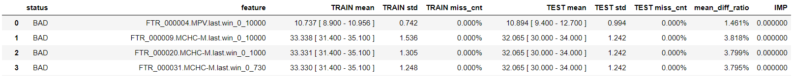
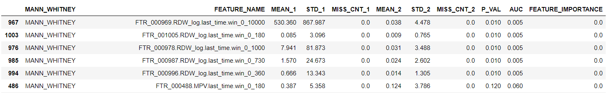

# Test 05 - Compare Repository with Reference Matrix

## Purpose

Compare the generated repository against a reference matrix to ensure data consistency and correctness.

## Required Inputs
From `configs/env.sh`:

- `WORK_DIR`: Output folder path to process and load the repository
- `MODEL_PATH`: Model path
- `REFERENCE_MATRIX`: full path to reference matrix (feature matrix from model train)
- `CMP_FEATURE_RES`: Comma-separated list of important features and their resolutions (e.g., `Age:1,MCH.slope.win_0_1000:0.01`). It will use those features to generate propensity model and compare this dataset to our reference.
    - Feature_Name: Unique string identifying the feature
    - Resolution: Used for plotting value distributions

## How to Run
From your TestKit folder, execute:
```bash
./run.specific.sh 5
```
Or include as part of the full suite:
```bash
./run.sh
```

## What This Test Does

This test checks the repository data against a predefined reference matrix. It highlights discrepancies and validates that the data meets expected standards before further analysis.

## Output Location

  - Full compare of all model features in `${WORK_DIR}/compare`
  - Compare of only important features defined by `CMP_FEATURE_RES` in `${WORK_DIR}/compare.no_overfitting`


## How to Interpret Results

The main goal of this test is to understand the differences between the current dataset, and the dataset that was used to train the model. It would be important, at later phase, in estimating model performance with the new dataset.

Each directory (`compare`, `compare.no_overfitting`) includes 4 major outputs: 

This test compares repository data to a predefined reference matrix, highlights discrepancies, and validates that the data meets expected standards before further analysis.

- `compare_rep.txt`: Compares mean, std, and missing values for each feature in reference and loaded repository
- `test_propensity.bootstrap.pivot_txt`: Shows separation between reference and input data
- `shapley_report.tsv`: Feature importance for the separation model
- `features_diff`: Graphs comparing top 10 most different features
### How to read compare_rep.txt
During the ETL we tested each signal against its reference. Here we test every feature.
The goal is to understand differences between the current dataset and the dataset used to train the model. This is important for estimating model performance on new data.
It includes 2 tables in txt format. Run the following code to turn it into readable dataframes.

```python
f = os.path.join(DIR, 'compare/compare_rep.txt')
t2 = pd.read_csv(f, sep= '\r')
t2 = t2[t2[t2.columns[0]].map(lambda x: x[0:3])=='MAN']
cut = t2.index.min()
t21 = pd.read_csv(f, nrows=cut)
t21['status'] = t21.index.map(lambda x: x[0].split(' ')[0])
t21['feature'] = t21.index.map(lambda x: x[0].split('::')[0].rstrip().split(' ')[-1])
t21['TRAIN mean'] = t21.index.map(lambda x: x[0].rstrip().split('mean=')[1])
t21['TRAIN std'] = t21.index.map(lambda x: x[1].rstrip().split('=')[1])
t21['TRAIN miss_cnt'] = t21.index.map(lambda x: x[2].rstrip().split('=')[1].split("|")[0])
t21['TEST mean'] = t21.index.map(lambda x: x[2].rstrip().split('mean=')[1])
t21['TEST std'] = t21[t21.columns[0]].map(lambda x: x.rstrip().split('=')[1])
t21['TEST miss_cnt'] = t21[t21.columns[1]].map(lambda x: x.split('|')[0].split('=')[1].rstrip())
t21['mean_diff_ratio'] = t21[t21.columns[1]].map(lambda x: x.split('mean_diff_ratio=')[1].split('|')[0].rstrip())
t21['IMP'] = t21[t21.columns[1]].map(lambda x: x.split(' ')[-1])
cols = ['status', 'feature', 'TRAIN mean', 'TRAIN std', 'TRAIN miss_cnt', 'TEST mean', 'TEST std', 'TEST miss_cnt', 'mean_diff_ratio', 'IMP'] 
t21 = t21[t21.status=='BAD'][cols].reset_index(drop=True)
 
t22 = pd.read_csv(f, skiprows=cut+1, sep='\t')
```
The first dataframe, t21, should be ignored.
t21 shows moments, range and missing values count, for every feature, comparing the reference to the new dataset.

The second dataframe, t22, shows the same information (without range), plus Mann Whitney test result.

- _1 is for the new dataset
- _2 is for the reference
- The Mann-Whitney U Test assesses whether two sampled groups are likely to derive from the same population, but note test limitations - if median and shape are the same for both samples, P_value would be high even for different std/scale. 

In table t22:
t21 shows moments, range, and missing value counts for every feature, comparing reference to new dataset.
- We need to make sure we don't see low P_value for any important feature to the model, or proxy for such features, i.e.. we may list MCH.min.win_0_180 as important feature, and we don't want it or MCH.min.win_0_360 to have low P-value.
- We need to understand the reasons for the low P-value when happened, in order to better understand the new data set. For instance, in the table above, we see that in the tested dataset RDW was not given close to sample point, probably because it is not part of the panel. As RDW is not an important signal, we can ignore it.

### How to read test_propensity.bootstrap.pivot_txt
If we looked in the compare directory - we are likely to see AUC=1, i.e., perfect separation between the two dataset. However, it is not a problem, as it might use features that are not important to the model.
Therefore, look in the file just in the `compare.no_overfitting` directory:
- `_1` is for the new dataset
- `_2` is for the reference
- Mann-Whitney U Test assesses whether two groups are likely from the same population. Note: if median and shape are the same, P_value may be high even for different std/scale.
- Higher AUC would reduce effective sample size when we match the samples to estimate performance in later stages, and smaller matched sample means bad accuracy.
- However often AUC is greater than 0.5, and we don't have a clear definition of what is bad:
    - 0.99 is bad, for sure, but what about 0.8? 0.7?
To see if we have statistically significant difference in one of the important feature, look at compare_rep.txt in the compare.no_overfitting directory. However, we may see very high AUC without any significant difference in any specific feature (recall Mann Whitney limitations mentioned above) ...
- Ensure no low P_value for any important feature or proxy features (e.g., MCH.min.win_0_180, MCH.min.win_0_360)
- Investigate reasons for low P_value to understand new dataset differences. For example, RDW missing near sample point may be due to panel differences; if not important, it can be ignored.
To better understand the results of the separation model we have two more outputs:

- shapley_report.tsv is a standard butwhy report, look in the file just in the compare.no_overfitting directory. Here you can see the feature importance in the separation model that uses just the important features of the model we want to apply to the dataset. 
- Graphical representation of the differences for every feature can be found in the feature_diff directory:
    - Look for anomalies in the graphs for the features with highest imprtance in the shapley report.
    - Always look at Age, as some other differences might be proxy to difference in Age distribution.
Good separation, no matter what feature/features were used, would hurt the accuracy of model performance estimate by matching (ass later). However, we don't have a good measure to say by how much ...  
 
### Example
- Watch `AUC_Mean`. Ideally, it should be close to 0.5. Higher values require inspection (e.g., missing signals, different age distribution).
- Higher AUC reduces effective sample size for performance estimation; smaller matched samples mean lower accuracy.
- Often AUC > 0.5, but no strict threshold for "bad" (e.g., 0.99 is bad, but what about 0.8 or 0.7?).

We see that the reference has several dominant values and this is due to imputations.

- In this case we use as reference a dataset different from the one we use for model training and feature importance.
- However, the reference dataset has many missing values for the relevant signal and imputations were generated that resulted in a binned, different resolution and distribution of the feature. It is of cource undesired situation, but not neccaraly very bad. The model was performing well in the dataset in spite of those missing values and imputations.
- Lesson learned is that we need to use as reference the original dataset (test samples only).

The reference matrix was generated again and than the AUC of this comparising dropped significantly.  

- `shapley_report.tsv`: Standard butwhy report in `compare.no_overfitting`, shows feature importance for separation model using important features.
- `features_diff`: Graphs for every feature; look for anomalies in features with highest importance in shapley report. Always check Age, as other differences may be proxies for age distribution.


