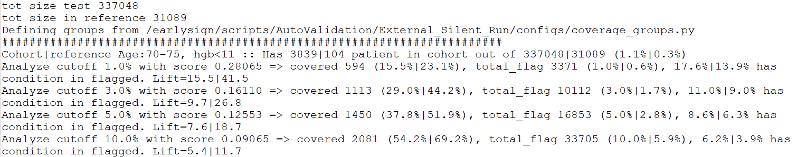

# Test 09 - Coverage Special Groups

## Purpose

Evaluate model performance and coverage in predefined special groups (high-risk cohorts). The test compares how many subjects from each special group are flagged at several top-percentile cutoffs in the test dataset vs the reference dataset and reports lift and coverage metrics.

## Required Inputs
From `configs/env.sh` and the test invocation environment:

- `WORK_DIR`: Working directory containing compare artifacts and prediction files
- `configs` Directory must contain `coverage_groups.py` - a Python file that defines the dictionary `cohort_f` with boolean filters for each special group.
- The test depends on Tests 05 and 06 and expects:
    - `${WORK_DIR}/compare/rep_propensity_non_norm.matrix`
    - `${WORK_DIR}/compare/rep_propensity.matrix`
    - `${WORK_DIR}/compare/3.test_cohort.preds`
    - `${WORK_DIR}/compare/reference.preds`

## How to Run
From your TestKit folder, execute:
```bash
./run.specific.sh 9
```
Or include as part of the full suite:
```bash
./run.sh
```

Check `${WORK_DIR}` and `${WORK_DIR}/compare` for generated logs and outputs.

## What This Test Does

- Loads the test and reference propensity matrices and prediction files and joins them to ensure every sample has `pred_0` (score) and the linking id `str_attr_original_id`.
- Computes cutoff scores corresponding to top positive rates (defaults: 1%, 3%, 5%, 10%) using the test dataset quantiles.
- Loads `coverage_groups.py` from `configs` folder. this file must populate `cohort_f` with boolean masks (filters) on the DataFrame `df` to define special groups in pandas.
- For each defined group the test computes, at each cutoff:
    - Number covered in the group (how many flagged within the group)
    - Total flagged across the dataset
    - Coverage percentages (group coverage vs group size, total flagged as share of dataset)
    - Lift and, where reference data exists for the same cohort, comparative metrics (reference coverage, lift in reference)
- Prints detailed per-cohort per-cutoff summaries to stdout (captured by the test runner logs).

## Output Location

- Primary printed output: test runner log (e.g., `${WORK_DIR}/09.coverage.log`) with per-cohort coverage/lift summaries
- Source inputs inspected: `${WORK_DIR}/compare/rep_propensity_non_norm.matrix`, `${WORK_DIR}/compare/rep_propensity.matrix`, `${WORK_DIR}/compare/3.test_cohort.preds`, `${WORK_DIR}/compare/reference.preds`

## How to Interpret Results

- For each special group and each positive-rate cutoff the test prints: the number covered in the cohort, cohort coverage percentage, total flagged and its share of the dataset, the fraction of flagged who belong to the cohort, and the lift (cohort coverage divided by expected share). When reference cohort filters are provided the test prints equivalent reference numbers and a pairwise lift comparison.
- Large differences in coverage or lift between test and reference can be caused by:
    - True population-level differences (e.g., different prevalence or age structure)
    - Data issues such as missing values or different coding 
    - Model-related behavior that flags different subpopulations

Interpretation advice:

- If a cohort is small (few patients), treat lift estimates as noisy and check absolute counts.
- If lift is high in the test but not in the reference, investigate whether the flagged cohort is genuinely higher-risk in this population or whether artifacts (imputation, sampling) explain the difference.

## Example output snippet



This analysis inspects the model's performance specifically within a high-risk cohort defined as: **Age: 70-75** AND **Last Hemoglobin (Hgb) < 11**.

1. Population Context

| Dataset | Size | Cohort Prevalence (Age 70-75, Hgb<11) |
| ------- | ---- | ------------------------------------- |
| Current Dataset| 337,048 | 1.1% |
| Reference Dataset | 31,089 | 0.3% |

Key Finding: The current dataset exhibits a significantly higher proportion of this high-risk group (1.1% vs. 0.3%). This suggests the current population has an elevated baseline risk profile compared to the reference.

2. Model Performance Metrics (Using Cutoff: 0.28065)
A decision score cutoff of 0.28065 was chosen to achieve a target ≈1% positive flag rate in the Current Dataset.

| Metric | Current Dataset | Reference Dataset | 
| ------ | --------------- | ----------------- |
| Overall Positive Flag Rate | 1.0% (3,371 flagged patients) | 0.6% |
| Cohort Coverage | 15.5% of patients within the cohort are flagged. | 23.1% of patients within the cohort are flagged. |
| Cohort Contribution to flagged | 17.6% of all flagged patients belong to this cohort | 13.9% of all flagged patients belong to this cohort. |
| Lift for cohort | 15.5 | 41.5 |

3. Interpretation and Observations
    1. Risk Acknowledgment: The model appropriately flags older patients with low hemoglobin. The 0.28065 cutoff results in 15.5% coverage of this high-risk group in the current population.
    2. Cutoff Effect: Applying the same cutoff (0.28065) to the healthier Reference Dataset yields a lower overall positive rate (0.6%), which is expected since the cutoff was calibrated on a higher-risk population (the Current Dataset).
    3. Lift: The "Lift" metric (the ratio of the group's flagging rate to the overall flagging rate) was observed to be higher in the Reference Dataset. This is because the high-risk cohort was rare in the healthier reference population, meaning that belonging to this group had a disproportionately higher impact on being flagged.

Final Note: While these statistics clearly show the model's behavior and the shifting population risk, there is no clear, defined threshold for what constitutes an unacceptable or "bad" result based solely on these performance shifts. Further definition of acceptable drift or performance degradation is required.

## Notes and Implementation Details

- The test reads and executes `coverage_groups.py` from `configs`. That file must define `cohort_f` as a dictionary mapping cohort names to boolean masks (expressions referencing `df`), e.g.:

```python
# inside coverage_groups.py
cohort_f['ElderlyHighRisk'] = (df['Age'] > 75) & (df['SomeLab'] > 2.0)
  ...
```
You might use a helper function `getcol(df, 'feature_name')` to access and exact specific column names from `df` DataFrame by iterating over the columns as searching for this substring. If multiple matches or no matches are found, an error will be thrown.
The available features are features the model uses and it suppose to be sufficient for sub grouping important groups.

- Default positive-rate cutoffs used are `[1, 3, 5, 10]` percent; you can adjust `coverage_groups.py` behavior or modify the script if needed.

## Troubleshooting

- Missing or malformed `coverage_groups.py`: the test will fail early with an error instructing you to provide the file. Ensure it defines `cohort_f` and uses `getcol` helper if needed.
- Join mismatches (missing IDs): the script will raise an error if the DataFrame sizes change unexpectedly after joining IDs and predictions - verify that `${WORK_DIR}/compare/rep_propensity.matrix` has `id`, `outcome`, and `str_attr_original_id` columns and that prediction files use matching `id` and `time` fields.
- Small cohort sizes: when cohort counts are small (e.g., <100), treat percentage/lift estimates as noisy; inspect absolute counts in logs.

## Test Results Review

Primary items to inspect after running this test:

- `${WORK_DIR}/09.coverage.log` (or the test runner log capturing stdout)
- `${WORK_DIR}/compare/rep_propensity_non_norm.matrix` and `${WORK_DIR}/compare/rep_propensity.matrix` (to check cohort selection and linking)
- `${WORK_DIR}/compare/3.test_cohort.preds` and `${WORK_DIR}/compare/reference.preds` (to inspect `pred_0` and sample times)

