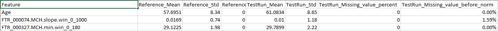
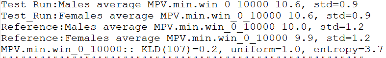

# Test 10 - Compare Important Feature

## Purpose

Compare distributions of the model's most important features between the current (test) dataset and the reference dataset. This test computes summary statistics, missing-value rates, KLD-based similarity measures, and produces per-feature histograms split by gender.

## Required Inputs
From `configs/env.sh` and the test invocation environment:

- `WORK_DIR`: working folder containing compare artifacts and matrices
- `CMP_FEATURE_RES`: comma-separated list of feature identifiers with resolution, format: FeatureName:resolution (e.g. "Hemoglobin:0.1,Age:1")
- The test depends on Test 05; expected files are:
	- `${WORK_DIR}/compare/rep_propensity.matrix`
	- `${WORK_DIR}/compare/rep_propensity_non_norm.matrix`

## How to Run
From your TestKit folder, execute:
```bash
./run.specific.sh 10
```
Or include as part of the full suite:
```bash
./run.sh
```

After run, check `${WORK_DIR}` and `${WORK_DIR}/compare` for generated files.

## What This Test Does

- Loads `${WORK_DIR}/compare/rep_propensity.matrix` and `${WORK_DIR}/compare/rep_propensity_non_norm.matrix` into pandas DataFrames.
- Filters the non-normalized frame to positive outcome rows (used to compute missing-value-before-normalization stats).
- Parses `CMP_FEATURE_RES` into two aligned lists: feature names (normalized to remove category prefixes like `ICD9_CODE:`) and numeric resolution values.
- For each feature in the list:
	- Matches the exact column in the matrix (error if ambiguous or missing)
	- Computes missing-value rates for test (outcome==0) and for positive cases using `-65336` as the sentinel missing value
	- Applies rounding/bucketing according to the provided resolution and computes grouped percentage distributions separately for:
		* Test_Run:Males (outcome>0 & Gender==1)
		* Test_Run:Females (outcome>0 & Gender==2)
		* Reference:Males (outcome==0 & Gender==1)
		* Reference:Females (outcome==0 & Gender==2)
	- Writes per-feature bar/histogram HTML into `${WORK_DIR}/features_graphs/<Feature>.html`
	- Computes a KLD score comparing positive vs reference distributions using `calc_kld` and prints KLD, KLD-to-uniform, and entropy
	- Appends feature-level statistics into `${WORK_DIR}/features_stats.tsv` with columns:
		Feature, Reference_Mean, Reference_Std, Reference_Missing_value_percent, TestRun_Mean, TestRun_Std, TestRun_Missing_value_percent, TestRun_Missing_value_before_norm

## Output Location

- `${WORK_DIR}/features_graphs/` — one HTML plot per feature (bar charts split by gender and dataset)
- `${WORK_DIR}/features_stats.tsv` — TSV summary of means, stds and missing rates
- Standard output / test log (e.g., `${WORK_DIR}/10.analyze_features.log`) containing per-feature KLD printouts and summary lines

## How to Interpret Results

- Use `features_stats.tsv` to quickly spot differences in means, spread, and missing-value rates between the test and the reference.
- Use the HTML graphs in `${WORK_DIR}/features_graphs/` to visually compare the binned distributions by gender and dataset.
- KLD values printed by the script quantify distributional divergence between positive cases and reference; higher KLD indicates larger distributional shift. Compare KLD across features to prioritize investigation.

Interpretation advice:

- Large mean or distribution differences together with large KLDs imply features where the test dataset deviates from the reference and that might explain model performance differences.
- High missing-value rates in the test (or large change in missing rate vs reference) may indicate data collection or ETL problems that need fixing before model deployment.

## Troubleshooting

- "Found X features for Y" NameError: If the script raises this, the feature name from `CMP_FEATURE_RES` matched multiple columns or none. Check `CMP_FEATURE_RES` spelling and column names in `${WORK_DIR}/compare/rep_propensity.matrix`.
- Missing `rep_propensity` files: ensure Test 05 completed successfully and produced `${WORK_DIR}/compare/rep_propensity.matrix` and `_non_norm.matrix`.
- Plot HTMLs referencing `plotly.js` not displaying: verify `${WORK_DIR}/features_graphs` contains the HTML files and that `../js/plotly.js` is present relative to the generated path. If Plotly is not available, copy `plotly.js` into `${WORK_DIR}/compare/js/` or change the path in the script.

## Example output snippets

1) `features_stats.tsv` example:



2) Log file `10.analyze_features.log`



3) Histogram Graph of features in `${WORK_DIR}/features_graphs`

## Notes and Implementation Details

- The resolution value controls binning: the script rounds values to the nearest multiple of the resolution before grouping.
- The script writes percentages (not raw counts) into the graphs and normalizes group counts to percentages so we can compare current dataset to reference.

## Test Results Review

Primary files to inspect after running this test:

- `${WORK_DIR}/features_graphs/` (HTML per-feature plots)
- `${WORK_DIR}/features_stats.tsv`
- Test runner log capturing stdout for KLD lines
