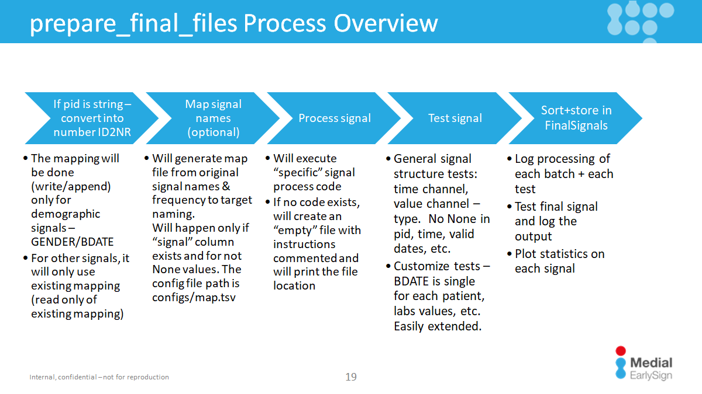

# Building the ETL Processing Pipeline

This section explains how to construct a processing pipeline in the ETL workflow using the `prepare_final_signals` function. This function applies your custom processing logic to data fetched in the previous step.

## Step-by-Step Guide
1. **Import Necessary Functions**: 
Start by importing the `prepare_final_signals` function and your custom data_fetcher.

```python
from ETL_Infra.etl_process import prepare_final_signals
from parser import generic_file_fetcher
```
2. **Define a Working Directory**: 
Specify the path where test results and output files will be stored.

```python
WORK_DIR = "..."  # Specify your working directory path
```

3. **Run the Pipeline**: 
Execute the pipeline with the following call:

```python
prepare_final_signals(
    generic_file_fetcher("^demo.*"),  # Fetch files starting with "demo"
    WORK_DIR,
    "demographic",  # Name of this processing pipeline
    batch_size=0,   # Process all files in a single batch
    override="n"    # Skip if already successfully completed
)
```

➡️ In this example:

* All files starting with `"demo"` are processed under the `"demographic"` pipeline (will be [explained next](#defining-processing-logic)).
* All files are read in a single batch (`batch_size=0`)`.
* `override="n"` prevents re-running an already completed process.

### Important Notes:

* You should repeat this process for each data type.
* **Best Practice for PID Mapping**: Start by processing demographic signals like BDATE and GENDER. This is because if patient IDs (pid) are strings, the ETL will create a numeric-to-string mapping based on these demographic signals. This mapping is then used for all other signals, ensuring consistent pid values across the entire dataset. More details on the pipeline can be seen next [Higher-Level Pipeline Flow](#higher-level-pipeline-flow)
* Use the `start_write_batch` parameter when multiple pipelines write to the same output signals. This ensures unique batch indices and prevents overwrites
* A single fetcher can feed multiple pipelines by specifying comma-separated names. For example:
```python
"gender,byear"
```
This sends demographic data to both gender.py and byear.py.

--------

## Defining Processing Logic

Each pipeline automatically looks for a processing script named after the pipeline (e.g., `demographic.py`).
This script must be located in the `signal_processings` folder alongside your main code.

## Inside the Script

* Input: A `DataFrame df` from the fetcher.
    - You can also use `workdir` as [WORKDIR](../../High%20level%20-%20important%20paths/WORK_DIR.md) folder path and `sig_types` and object with signal type definitions. A usefull function is to retrived other processed signal, in that example `BDATE` with `df_bdate = load_final_sig(workdir, sig_types, "BDATE")`
* Output: A transformed DataFrame in the required format, still called `df`.
* Any `print` statements will be captured in a log file.

**A Note on Signal Processing**: 

* If the DataFrame contains a `signal` column, the system generates a **mapping file** for easier renaming and mapping. Please refer to [Signal Mapping](#higher-level-look-on-the-pipeline).
* If `signal` is non-null, processing is grouped by signal names instead of pipeline names.
* Each signal belongs to hierarchical groups (tags and aliases). Example:
```
SIGNAL	BDATE	102	16:my_SInt	demographic,singleton,date	0	date
SIGNAL	Hemoglobin	1000	16:my_SDateVal	labs,cbc	0	g/dL
```
* signal `"BDATE"` is linked to `demographic`, `singleton`, and `date`.
* `"Hemoglobin"` belongs to `labs` and `cbc`

➡️ Processing order:
If a dedicated script exists (e.g., `Hemoglobin.py`), it will be used. 
Otherwise, the system looks from the most specific to least specific tag (e.g., first `cbc.py`, then `labs.py`).

Link to [File Definition of All Signals](https://github.com/Medial-EarlySign/MR_Tools/blob/main/RepoLoadUtils/common/ETL_Infra/rep_signals/general.signals)

**Debugging**
To debug, add `breakpoint()` in your script. No changes to ETL infrastructure code are required.

## Required Output Format

The final DataFrame **must include**:

* `pid`: Patient identifier (already required in fetching step)
* `signal`: The name of the signal (e.g., 'GENDER', 'Hemoglobin'). This must be a recognized signal. The system will provide an error with instructions if a signal is unknown (How to define a new signal if needed).
* `time_X`: Time channels, where X is an index. These should be stored as integers in YYYYMMDD format.
* `value_X`: Value channels, where X is an index. These can be float, integer, or string (for categorical data)

❌ Any other columns will be ignored during the final loading process.

✅ Column order doesn’t matter - the ETL system arranges them automatically.

**Special Cases**

* For categorical signals, see [Categorical Signals](Categorical%20signal_%20Custom%20dictionaries.md)
* For signals that needs unit conversion, this guide can be helpful: [Unit Conversion](unit_conversion)

## Example Processing Code

Here's an example of the code you would write inside the `demographic.py` file to process a DataFrame and create a `GENDER` signal.

```python
# Input: DataFrame 'df' with patient data
# Goal: Create 'GENDER' signal from 'Sex' column

# The output DataFrame should have these columns:
#   pid
#   signal
#   value_0 (string categorical, e.g., 'Male', 'Female')

# 1. Select and rename columns
df = df[['pid', 'Sex']].rename(columns={'Sex': 'value_0'})

# 2. Add the 'signal' column with the signal name
df['signal'] = 'GENDER'

# 3. Standardize the values
df.loc[df['value_0'] == 'male', 'value_0'] = 'Male'
df.loc[df['value_0'] == 'female', 'value_0'] = 'Female'

# 4. Finalize the DataFrame by keeping only required columns and removing duplicates
df = df[['pid', 'signal', 'value_0']].drop_duplicates().reset_index(drop=True)

# The 'df' is now ready for the next stage of the pipeline
```

## Higher-Level Pipeline Flow

Every pipeline includes the following stages:

1. **PID Mapping:**  
    - Convert non-numeric IDs to numeric.
    - Mapping stored in `[WORK_DIR]/FinalSignals/ID2NR`.
    - Demographic signals (signals with "demographic" tag) create the mapping; all others join on it.

2. **Signal Mapping:** 
    - If `signal` column exists and not-null, optional name mappings can be done using `configs/map.tsv`. 
    - File lists source → destination mappings, ordered by frequency. Empty lines without destination value will be ignored in the mapping.

3. **Data Transformation:**  
    - Transform the DataFrame to the final format.  
    **This is the process unit that we wrote here in the ETL.**

4. **Testing:**  
    - Run automatic format tests, followed by deeper tests (e.g., lab distributions).
    - See [Extending and adding tests](../ETL_process%20dynamic%20testing%20of%20signals.md)

5. **Storing:**  
    - Sort and save the processed data in `[WORK_DIR]/FinalSignals`.



## Next Step: Prepare Dicts if needed

If your project requires client-specific dictionaries, follow this guide:
[Prepare Special Dicitonaries](Categorical%20signal_%20Custom%20dictionaries.md)

Once you have you finished, follow [this guide](../03.Finalize%20Load#3-optional-prepare-special-client-dictionaries) to finalize the loading