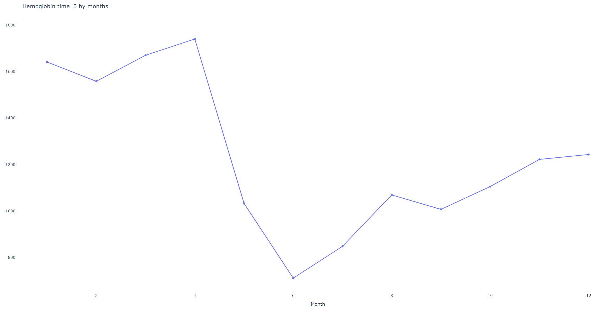
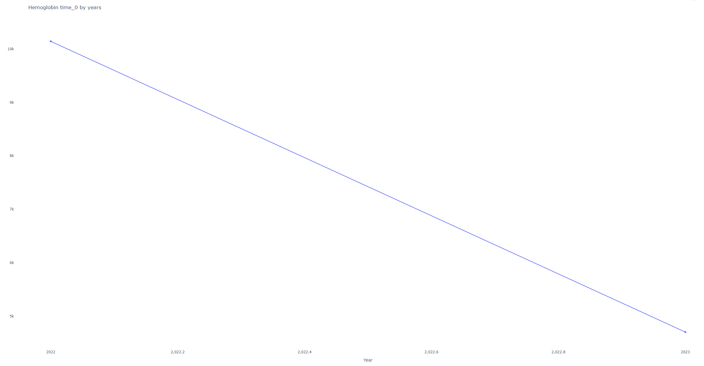
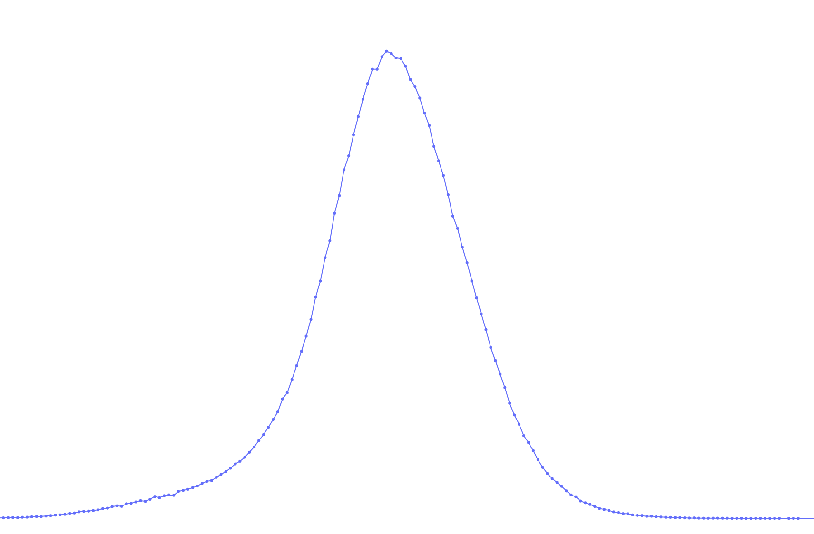
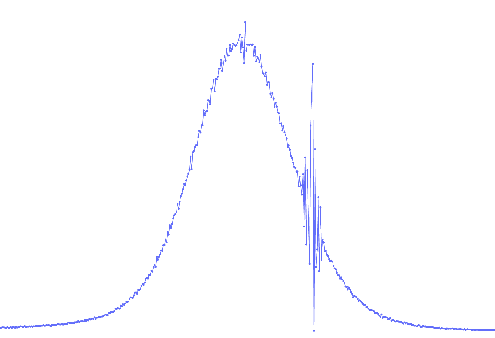

## Reviewing ETL loading results

## Purpose

This page explains how to inspect and interpret the ETL outputs after running the ETL process. It tells you where to find logs and visualizations, what the most important checks are, and how to spot common issues such as unit mismatches or unexpected value distributions.

Where outputs are stored

All ETL outputs are written under the repository `WORK_DIR`. See the high-level path: [WORK_DIR](../../High%20level%20-%20important%20paths/WORK_DIR.md).

Key folders to review:

- `signal_processings_log/` - per-signal processing logs and diagnostics.
- `outputs/` - summary test logs (named `tests.*log`) produced by the validation checks. Directory for each signal and its distribution values.

## How-to: quick checklist

1. Open `outputs/tests.*log` (for example `outputs/tests.labs.log`) to read automated validation results.
2. If the test log reports anomalies, inspect the per-signal directory under `outputs/$SIGNAL/` for plots/visualizations and batch-level reports to help confirm unit consistency and distribution shapes.

## Example — reading a test log

Here is a representative excerpt from `outputs/tests.labs.log` (Hemoglobin checks):

```text
Done testing nulls in signal Hemoglobin
unit:g/L || KLD (127)= 0.005790, KLD_to_Uniform=0.740022, entory_p=4.105875, grp_cnt=8444, group_counts=1/4
unit:g/l || KLD (127)= 0.010441, KLD_to_Uniform=0.740022, entory_p=4.105875, grp_cnt=6995, group_counts=2/4
There are issues with low range, please have a look (more than factor 3)
       q  value_0  reference     ratio1    ratio2      ratio
0  0.001   80.908        7.2  11.237223  0.088990  11.237223
1  0.010  102.000        9.0  11.333333  0.088235  11.333333
2  0.100  126.000       11.2  11.250000  0.088889  11.250000
There are issues with the median, please have a look (more than factor 2)
     q  value_0  reference     ratio1    ratio2      ratio
3  0.5    145.0       13.3  10.902255  0.091724  10.902255
There are issues with high range, please have a look (more than factor 3)
       q  value_0  reference     ratio1    ratio2      ratio
4  0.900    163.0  15.300000  10.653595  0.093865  10.653595
5  0.990    178.0  16.799999  10.595239  0.094382  10.595239
6  0.999    189.0  17.900000  10.558659  0.094709  10.558659
Done testing values of signal Hemoglobin
```

## Mechanism — what this output tells you

- KLD (Kullback–Leibler divergence) per source indicates how similar that source's value distribution is to the overall signal distribution. Small KLD (<< 1) means similar.
- The sections labelled "There are issues with ..." flag quantile-level discrepancies between the current dataset and a reference distribution. These point to potential unit mismatches, data-entry issues or population differences.

### Columns in the discrepancy tables

- `q`: quantile being compared (for example 0.001, 0.5, 0.999)
- `value_0`: quantile value in the current dataset
- `reference`: quantile value in the reference dataset
- `ratio1`: value_0 / reference
- `ratio2`: 1 / ratio1
- `ratio`: max(ratio1, ratio2) — used to highlight large deviations

### Interpreting large ratios

Large ratios (for example ~10) often indicate unit mismatches. A common case for Hemoglobin is `g/L` vs `g/dL` (multiply `g/dL` by 10 to get `g/L`). If you see a consistent factor across quantiles, consider converting units or normalizing the source before further processing.

> [!IMPORTANT]
> If there are mismatches in the input, loading does not fail by default. Warnings will appear in the logs. It is your responsibility to review and correct data issues where needed.

## Deep-dive: log locations and visual aids

- Signal specific test log: `ETL/outputs/test.$SIGNAL.log`
- Signal processing log (runtime messages, dropped lines): `ETL/signal_processings_log/$SIGNAL.log`
- Batch-level charts and aggregated reports: `ETL/signal_processings_log/$SIGNAL/batches/` and `ETL/signal_processings_log/$SIGNAL`

## Practical checks and recommended workflow

1. Scan `outputs/tests.*log` for flagged issues.
2. For flagged signals, open `signal_processings_log/$SIGNAL/` and inspect per-signal log for dropped records and warnings.
3. Use the charts in `ETL/outputs/$SIGNAL` to confirm whether a discrepancy comes from unit differences, data entry errors, or genuine population shifts.
4. If a unit mismatch is found, apply a unit conversion and re-run the pipeline for that signal.

## Visual examples

### Example 1 — monthly vs yearly distribution (Hemoglobin)

Monthly charts can look noisy when most data come from a single year. In that case, check both monthly and yearly views to avoid false alarms.




### Example 2 — distribution shape check

On the right is a smooth (expected) distribution. On the left are unexplained "vibrations"; they may indicate data-quality issues or batch artifacts. Discuss with the dataset owner to confirm.


