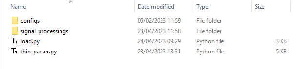

# 📁 CODE_DIR: Your ETL Workspace

The `CODE_DIR` is the primary location for all code specific to your ETL process. It typically contains two main Python files: a helper library for parsing and `load.py`, which is the entry point for the entire loading process.


---

### Key Directories and Files

-   **`configs`**: This folder stores configurations specific to your ETL. While it might be empty, it commonly contains settings for unit and signal mapping.
    -   **`rep.signals`**: This file is created for you as a template. You can **override or add new signal definitions** that are specific to your repository. New signals should use an ID of `3000` or greater. The file format is consistent with the [global signal format](../../Repository%20Signals%20file%20format.md).
    -   **`map_units_stats.cfg`**: Used if you are performing signal mapping and unit conversions. This file contains the configuration for those conversions.
    -   Additional configuration files can be added as needed. For more details: [unit_conversion](../../Solution%20details%20-%20ETL_process%20tool/ETL%20Tutorial/02.Process%20Pipeline/unit_conversion)
-   **`signal_processings`**: This folder contains the custom logic for processing different signals and data types.
    -   **`XXXX.py`**: Each file here is a Python script with specific processing logic. For example, `labs.py` would process all signals tagged as "labs" (unless a more specific file exists). The system uses a hierarchical search: for a signal tagged "labs,cbc,Hemoglobin," it first looks for `Hemoglobin.py`, then `cbc.py`, then `labs.py`. This structure promotes code reuse.
    -   If no suitable logic was found, a template python file with signal name and instructions will be created automatically. The template shows you the expected input dataframe (`df`) and the required output format, guiding you to write the appropriate processing code. For example:
```python
#You have dataframe called "df". Please process it to generare signal/s of class "smoking"
#Example signal from this class might be Smoking_Status
#The target dataframe should have those columns:
#    pid
#    signal
#    time_0 - type i
#    value_0 - string categorical (rep channel type i)
#Source Dataframe - df.head() output:
#     time_0     ahdcode ahdflag      data1   data2      data3 data4 data5 data6  medcode signal  pid
#0  19880705  1008050000       Y             INP001                N           Y  4K22.00   None    1
#1  19921209  1005010200       Y  81.000000          28.300000                    22A..00   None    1
#2  19921209  1003050000       Y          Y       2                               136..00   None    1
#3  19921209  1003040000       Y          N       0                               137L.00   None    1
#4  19930000  1001400086       Y                                                  537..00   None    1
```

-   **`tests`**: An optional and rarely used folder for adding extra tests specific to your ETL process. It follows the same format as the `tests` folder in `ETL_INFRA_DIR`, and its contents are merged with the global tests during execution.