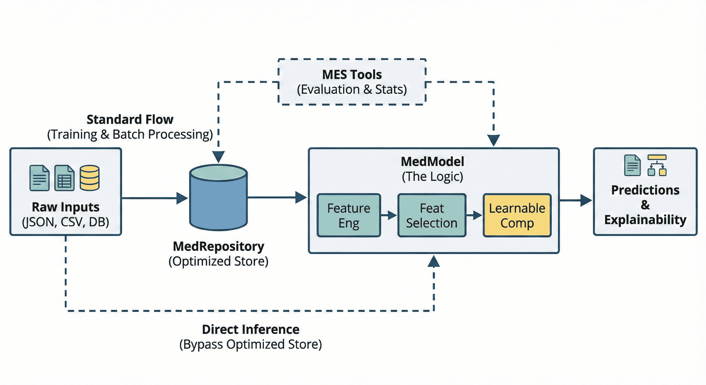
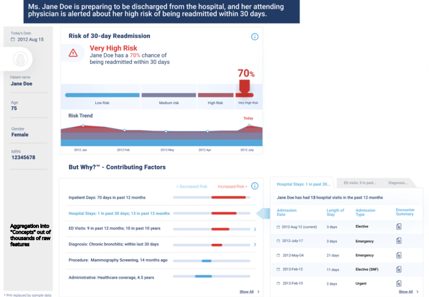

# Home


[](https://anaconda.org/conda-forge/medpython)
[](https://anaconda.org/conda-forge/medpython)


[](https://github.com/Medial-EarlySign/medpython)


**A note on our journey:** Medial EarlySign was a company that developed a proprietary platform for machine learning on electronic medical records. Following the company's liquidation, the decision was made to release the core software as an **open-source** project to allow the community to benefit from and build upon this technology. Please feel free to [reach me out](#community-and-contributions) in any case of an issue. I'm voluntarily holding this, so please be patients.

Our platform is designed to transform complex, semi-structured Electronic Medical Records (EMR) into **machine-learning-ready** data and reproducible model pipelines. The framework is optimized for the unique challenges of sparse, time-series EMR data, delivering **low memory usage** and **high-speed processing** at scale.
It was conceived as a **TensorFlow** for machine learning on medical data.

The framework was battle-tested in production across multiple healthcare sites and was a key component of an **award-winning** submission to the [CMS AI Health Outcomes Challenge](https://www.cms.gov/priorities/innovation/innovation-models/artificial-intelligence-health-outcomes-challenge).

You can also refer to our [existing models](Models) using our Infrastructure. Most of them are only available for usage through our partners, but some are planned to be released to the public.

## From Raw Data to Insight in Four Simple Steps

Our platform streamlines the development and deployment of clinical predictive models, transforming raw patient data into actionable insights. For live predictions (inference), you can use raw JSON data directly, bypassing the need for an optimized data store.



This structured approach ensures that data is processed efficiently, models are built systematically, and the results are both accurate and interpretable.

### The Workflow

**1. Start with Raw Patient Data**

Begin with your data in a simple JSON format.

```json
{
  "patient_id": "1",
  "data": {
    "signals": [
      {
        "code": "Hemoglobin",
        "unit": "g/dL",
        "data": [
          { "timestamp": [20240806], "value": ["14.1"] },
          { "timestamp": [20250806], "value": ["14.5"] }
        ]
      },
      {
        "code": "Diagnosis",
        "data": [
          { "timestamp": [20240701], "value": ["ICD10_CODE:J20"] },
          ...
        ]
      },
      ...
    ]
  }
}
```

Load it into our Optimized Store or use it "as is" in deployment.
Seamlessly integrate with standard systems using a [lightweight Python script](https://github.com/Medial-EarlySign/MR_Tools/blob/main/test_algomarker/fhir_to_medpython.py) to transform FHIR/Epic JSON into the AlgoMarker format on deployment (map input signal name and units).

**2. Define Your Label**

For each patient, and for any chosen prediction date (after which no future information is provided to the model), specify what the outcome label should be for training or testing

**3. Define Your ML Pipeline**

Configure your entire machine learning workflow from preprocessing and feature engineering to the final model using a single [JSON configuration file](Infrastructure%20Library/MedModel%20json%20format.md). This approach ensures your experiments are reproducible and easy to version.

**4. Get Explainable Predictions**

Train your model using the Python SDK and generate predictions with clear, interpretable explanations. [Example output](Tutorials/07.Deployment/index.md#how-to-use-the-deployed-algomarker).

This is an illustration of the final output in a visual format (Our infrastructure returns the data to create this):



For more details, refer to the [Tutorials](Tutorials).

## Quick Installation

You can quickly install the package using **pip**:

```bash
pip install medpython
```
Alternatively you can install it through `conda-forge` channel:
```bash
conda install medpython
```

For detailed system requirements and compilation instructions, please see the [Installation Guide](Installation/index.md).

> **[NOTE]** Pre-builds are provided for Python 3.10-3.14 on Linux, Windows, and Mac.
> 
> Users on Alpine (or other non-glibc distros) and other Python versions must compile manually. See the Alpine compilation guide for instructions.

## Why Use This Platform?

*   **High-Performance Processing:** Engineered for large-scale, sparse EMR time-series data where general-purpose libraries like pandas fall short.
*   **Reusable Pipelines:** Save valuable engineering time by providing shareable, tested pipelines and methods.
*   **Built-in Safeguards:** Mitigate common pitfalls like data leakage and time-series-specific overfitting.
*   **Production-Ready:** Designed for easy deployment using Docker or minimal distroless Linux images. **FHIR Ready** with lightweight python script convert to AlgoMarker format in deployment.
*   **Innovative Algorithms:** Access to outperforming algorithms for processing medical data, explainability, fairness, and more.

## Core Components

The platform is built on three key pillars:

*   **MedRepository:** A compact, efficient data repository and API for storing and accessing EMR signals.
*   **MedModel:** An end-to-end machine learning pipeline for training and inference, producing predictions and explainability outputs.
*   **Medial Tools:** A suite of utilities for training, evaluation, and workflow management.

## Getting Started

*   **Build your first model:** Follow our [Complete Example: From Data to Model](Tutorials/08.A_Complete_Example.md) to learn the end-to-end process.
*   **Explore other tutorials:** Dive into specific topics with our step-by-step [Tutorials](Tutorials/).
*   **Use an existing model:** Browse the collection of [Models](Models) or learn how to deploy a model with [AlgoMarker Deployment](Tutorials/07.Deployment/).

## Community and Contributions

This is an open-source project, and we welcome contributions from the community.

*   **Report issues or ask questions:** Please use our [Github Discussions](https://github.com/Medial-EarlySign/medpython/discussions).
*   **Contribute to the code:** Check out our repositories:
    *   [medpython](https://github.com/Medial-EarlySign/medpython): The core infrastructure libraries.
    *   [MR_Tools](https://github.com/Medial-EarlySign/MR_Tools): Tools and pipelines built on top of medpython.
    *   [MR_Scripts](https://github.com/Medial-EarlySign/MR_Scripts): Dev Ops tools

All software is open-sourced under the MIT license.
